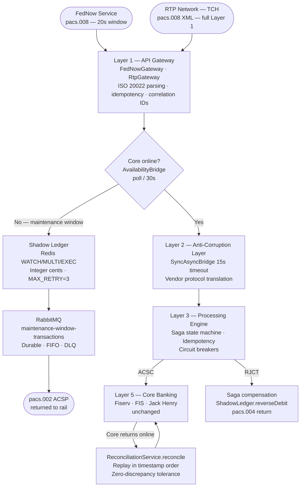

# OpenFedNow — Legacy Core to U.S. Instant Payment Rails

**Open-source middleware connecting legacy core banking systems to U.S. instant payment rails — FedNow and RTP — through a reusable, rail-agnostic core framework.**

[](LICENSE)
[]()
[]()
[]()

73% of U.S. financial institutions cite legacy core banking systems as a moderate-to-severe obstacle to FedNow participation because their core systems — Fiserv, FIS, Jack Henry — were built for batch processing, not 24/7 real-time settlement. This framework bridges the gap without touching the core.

> **Sandbox / reference implementation.** The reusable core framework — five-layer architecture, dual-rail Layer 1 (FedNow + RTP), all three vendor adapters, saga lifecycle (recovery / timeout monitor / compensation retry), idempotency, reconciliation, fraud screening, cancellation handling, rate limiting, admin audit, and the production-hardening pass (transactions, headers, graceful shutdown, retries, dependency scanning) — is implemented and tested across 500+ unit and integration tests. Live rail connectivity remains credential-, certification-, and institution-dependent. See [docs/known-limitations.md](docs/known-limitations.md) and the [Production Boundaries](#production-boundaries) section for what remains.

---

## What works today

| Component | Status |
|-----------|--------|
| Five-layer architecture | ✅ Implemented |
| ISO 20022 message models (pacs.008, pacs.002, pacs.004, camt.056/029) | ✅ Implemented |
| Cancellation handling — inbound camt.056 → camt.029 with state-keyed decision matrix | ✅ Implemented on both rails; CNCL reverses Shadow Ledger credit and terminates saga. See [ADR-0007](docs/adr/0007-camt056-cancellation-lifecycle.md) |
| Fraud pre-screening — `FraudScreeningPort` with rule-based default (amount cap, debtor velocity, denylist) | ✅ Disabled by default; opt-in via `openfednow.fraud.enabled=true`. BLOCK returns RJCT FRAD before any side effects. Institutions swap in their own port for production. See [ADR-0008](docs/adr/0008-fraud-screening.md) |
| SandboxAdapter — all scenarios: ACSC, RJCT, ACSP, timeout | ✅ Implemented |
| MockVendorAdapter — in-memory balance ledger, configurable failure modes | ✅ Implemented; `CoreBankingAdapterContractTest` enforces adapter contract |
| `CoreBankingAdapter` contract | ✅ Implemented |
| Shadow Ledger — Redis-backed, WATCH/MULTI/EXEC optimistic locking | ✅ Implemented + tested |
| Shadow Ledger endpoint wiring (inbound + outbound) | ✅ Implemented |
| 24/7 Bridge Mode — queues payments during core maintenance window | ✅ Implemented + tested |
| Reconciliation — replay and sync after core returns online | ✅ Implemented + tested |
| Reconciliation pagination — keyset-paginated account scan for large institutions | ✅ Configurable batch size (default 500); memory stays flat regardless of pending-account count |
| Saga orchestration — compensation on core rejection | ✅ Implemented + tested |
| Idempotency — Redis + PostgreSQL dual-write, 48h window | ✅ Implemented + tested |
| Concurrent overdraft prevention under load | ✅ Tested (race-condition suite) |
| Send-side (outbound) payment flow | ✅ Implemented |
| Payment returns (pacs.004 outbound) | ✅ `POST /fednow/return` with retry + JWS signing; sandbox and HTTP clients implement `FedNowClient.submitReturn` |
| Admin auth — HTTP Basic on `/admin/*` | ✅ Implemented as reference configuration |
| Admin audit log — every `/admin/**` access recorded to PostgreSQL | ✅ Implemented; both GRANTED and DENIED captured, surfaced via `GET /admin/audit-log` |
| Admin query endpoints — saga state, balances, reconciliation history | ✅ `GET /admin/sagas[/{txId}]`, `/admin/accounts/{id}/balance`, `/admin/reconciliation-runs[/{id}]`, `/admin/audit-log` |
| Saga recovery on application restart | ✅ `ApplicationReadyEvent` listener; dispatches each non-terminal saga by state (compensate, advance, finalize) |
| Saga timeout monitor — auto-compensate stalled sagas | ✅ `@Scheduled` sweep; ISO 20022 `XPIR` reason; `saga.timeout` Micrometer counter |
| Balance seeding from core on startup | ✅ Configurable account list seeded via SETNX; `POST /admin/shadow-ledger/seed` for on-demand re-seed |
| Idempotency cleanup — scheduled sweep of expired Postgres rows | ✅ Configurable TTL (default 48h) and sweep cadence (default 60min) |
| Rate limiting — per-client on `/fednow/**` and `/rtp/**` POSTs | ✅ Resilience4j `RateLimiter` per IP / X-Forwarded-For; 429 + Retry-After; `gateway.rate_limited` counter |
| Saga compensation retry — sweeps FAILED sagas with missing REVERSAL rows | ✅ `@Scheduled` retry; idempotent reversal primitives; `saga.compensation.retry.succeeded` and `.failed` counters |
| Admin audit log retention — scheduled cleanup of `admin_audit_log` | ✅ Configurable retention (default 365 days) and sweep cadence |
| Transactional boundaries — multi-statement writes commit atomically | ✅ `@Transactional` on `SagaOrchestrator.compensate` / `cancelInboundSaga`; `TransactionTemplate`-wrapped per-account reconciliation |
| Idempotent Shadow Ledger reversals — safe under retry | ✅ `reverseDebit` and `reverseCredit` skip on existing REVERSAL row; one-call semantics from any caller |
| Default-credential startup guard | ✅ `@PostConstruct` check refuses to start the `prod` profile if admin credentials are still the sandbox defaults |
| HTTP security headers — HSTS, X-Content-Type-Options, X-Frame-Options, Cache-Control | ✅ Configured in `SecurityConfig`; verified end-to-end via `SecurityHeadersTest` |
| CORS — deny-by-default for server-to-server API | ✅ Explicit empty `CorsConfigurationSource`; institutions registering a browser-origin allow-list override the bean |
| Graceful shutdown — drain in-flight requests on SIGTERM | ✅ `server.shutdown=graceful` + 30s drain window; Helm `terminationGracePeriodSeconds: 60` |
| HikariCP tuning — prod-sized connection pool | ✅ Pool 50 / min-idle 10 / 5s connection timeout — sized for FedNow throughput; tunable via env |
| Outbound FedNow retry — transient-failure resilience | ✅ Resilience4j retry: 3 attempts, exponential backoff with jitter; retries 5xx + network errors, fast-fails 4xx |
| Fraud screening timeout — hard cap on port calls | ✅ `CompletableFuture` deadline (default 1500ms); fails open on timeout / exception |
| Atomic velocity counter — single Redis Lua script | ✅ `INCR` + `EXPIRE` in one round-trip; sliding window matching the documented semantic |
| Reconcile concurrency guard — same-JVM serialization | ✅ `ReentrantLock` with tryLock; second concurrent call returns "Skipped" report rather than racing |
| Saga source-rail tracking — dual-rail dispatch foundation | ✅ `source_rail` column on `saga_state` (V5); both gateways thread `Rail` through `MessageRouter` |
| Dependency scanning — Dependabot + OWASP dependency-check | ✅ Weekly Maven + Actions updates; OWASP scan fails the build on CVSS ≥ 7 |
| CI — unit + integration test jobs | ✅ GitHub Actions workflow runs unit tests + Testcontainers-backed integration tests on every PR |
| Dual-rail architecture (FedNow + RTP) | ✅ ISO 20022 foundation; Layer 1 varies, Layers 2–4 rail-agnostic; source rail persisted on `saga_state` |
| RTP Layer 1 — inbound XML, outbound XML, TCH cert validation hook, sandbox + HTTP client | ✅ Implemented; symmetric with FedNow Layer 1 |
| Optional Kafka event bus — `PaymentEventPublisher`, 6 event types | ✅ Implemented (disabled by default; no Kafka required) |
| Event schema versioning — `schemaVersion` field + `X-Schema-Version` / `X-Event-Type` headers | ✅ Implemented; JSON Schema in `docs/event-schemas/`; strategy documented in [ADR-0006](docs/adr/0006-event-schema-versioning.md) |
| Vendor adapters (Fiserv, FIS, Jack Henry) | ✅ All three implemented — OAuth 2.0 authentication, vendor error code → ISO 20022 mapping, WireMock integration test suite. Fiserv + FIS via REST/JSON, Jack Henry via jXchange SOAP. |
| FedNow JWS message signing — outbound RS256 detached signature + inbound verification | ✅ Implemented per RFC 7515 + RFC 7797 with `b64=false`; opt-in via `openfednow.fednow.signing.enabled=true`. See [ADR-0009](docs/adr/0009-fednow-jws-message-signing.md) |
| Live FedNow connectivity (Fed PKI, mTLS) | 🔲 Credential/certification-dependent; simulator-compatible HTTP client implemented |
| Live RTP connectivity (TCH network, TCH PKI certificates) | 🔲 TCH onboarding/certification-dependent; `HttpRtpClient` and full XML pipeline implemented |

See [docs/known-limitations.md](docs/known-limitations.md) for the full gap analysis.

---

## Architecture



---

## Key documents

| Document | What it answers |
|----------|-----------------|
| [docs/known-limitations.md](docs/known-limitations.md) | Current implementation boundaries, credential-dependent live connectivity, and production-readiness gaps |
| [docs/rtp-compatibility.md](docs/rtp-compatibility.md) | RTP Layer 1 status, symmetric with FedNow at the framework level; TCH live connectivity pending institutional credentials |
| [docs/shadow-ledger.md](docs/shadow-ledger.md) | How the Shadow Ledger works, failure modes |
| [docs/saga-pattern.md](docs/saga-pattern.md) | Compensation path when core rejects post-ACSP |
| [docs/event-schemas/README.md](docs/event-schemas/README.md) | Kafka domain event schema versioning policy |
| [docs/adr/0001-optimistic-locking-shadow-ledger-debits.md](docs/adr/0001-optimistic-locking-shadow-ledger-debits.md) | Why WATCH/MULTI/EXEC, the Lettuce caveat |
| [docs/adr/0003-provisional-acceptance-acsp.md](docs/adr/0003-provisional-acceptance-acsp.md) | Why ACSP is returned, the exposure window |
| [docs/adr/0004-eventual-consistency-shadow-ledger-and-core.md](docs/adr/0004-eventual-consistency-shadow-ledger-and-core.md) | Why eventual consistency, why not 2PC |
| [docs/adr/0005-dual-rail-architecture-fednow-rtp.md](docs/adr/0005-dual-rail-architecture-fednow-rtp.md) | Decision: keep Layers 2–4 rail-agnostic |
| [docs/adr/0006-event-schema-versioning.md](docs/adr/0006-event-schema-versioning.md) | Hybrid header + envelope event versioning |
| [docs/adr/0007-camt056-cancellation-lifecycle.md](docs/adr/0007-camt056-cancellation-lifecycle.md) | camt.056 → camt.029 decision matrix keyed on saga state |
| [docs/adr/0008-fraud-screening.md](docs/adr/0008-fraud-screening.md) | Port-based fraud screening with a configurable default rule set |
| [docs/adr/0009-fednow-jws-message-signing.md](docs/adr/0009-fednow-jws-message-signing.md) | RS256 detached JWS with `b64=false` per RFC 7515 + 7797 |

---

## The Problem

The Federal Reserve's FedNow Instant Payment Service launched in July 2023. As of early 2026, only approximately 1,500 of the nation's 10,000+ financial institutions have connected — roughly 16% of the eligible ecosystem.

The barrier is not cost or intent. Industry research documents that **73% of U.S. financial institutions cite legacy core banking systems as a moderate-to-severe obstacle** to FedNow participation (U.S. Faster Payments Council / Finzly, 2024). The core banking platforms that power the majority of U.S. banks — Fiserv, FIS, and Jack Henry — were designed for batch-processing cycles, not 24/7 real-time settlement.

This creates four fundamental incompatibilities:

- **Processing model mismatch** — Legacy systems process in batches; FedNow requires sub-20-second event-driven responses
- **Availability mismatch** — Legacy systems have maintenance windows; FedNow operates 24/7/365
- **Protocol mismatch** — Legacy systems use proprietary APIs; FedNow uses ISO 20022 REST/JSON messaging
- **Concurrency mismatch** — Legacy systems were not designed for high-volume simultaneous transaction loads

These incompatibilities cannot be resolved by adding API endpoints. They require purpose-built architectural layers that bridge the two paradigms — allowing institutions to participate in FedNow without replacing their existing core systems.

---

## The Solution

OpenFedNow is a five-layer middleware framework that resolves each of these incompatibilities through architectural patterns drawn from production-scale instant payment integration experience.

The framework is designed around a key insight: based on a count of production Java source lines in `src/main/java` (excluding tests, documentation, and generated files), **approximately 87% of the integration architecture is shared across all financial institutions**. Only the Core Banking Adapter — approximately 13% of the total engineering scope — varies per core banking vendor. This means that building adapters for the three dominant U.S. platforms covers the majority of the market without duplicating the underlying work.

### Core Banking Platform Coverage

| Vendor | U.S. Bank Market Share | U.S. Credit Union Share |
|--------|------------------------|------------------------|
| Fiserv (DNA, Precision, Premier, Cleartouch) | 42% | 31% |
| Jack Henry (SilverLake, Symitar, CIF 20/20) | 21% | 12% |
| FIS (Horizon, IBS) | 9% | — |
| **Big Three combined** | **>70%** | |

*Source: Federal Reserve Bank of Kansas City, Market Structure of Core Banking Services Providers, March 2024.*

Three adapter implementations make the complete framework available to thousands of institutions.

---

## Quick Start

**Prerequisites:** Java 17+, Docker.

```bash
git clone https://github.com/danielsmori/open-fednow
cd open-fednow
docker-compose up -d redis rabbitmq    # Redis + RabbitMQ (Kafka is optional)
mvn spring-boot:run                    # → http://localhost:8080
```

Once the app is running (look for `Started OpenFedNowApplication` in the console), verify it's up:

```bash
curl http://localhost:8080/fednow/health
# → OpenFedNow Gateway — operational
```

Then run the demo:

```bash
./demo/run-demo.sh
```

That's it. The script runs all four scenarios — ACSC, RJCT, ACSP, reconcile — and prints pass/fail for each.

### What the demo does (step by step)

### 1. Send a payment (core online)

```bash
curl -s -X POST http://localhost:8080/fednow/receive \
  -H "Content-Type: application/json" \
  -d '{
    "messageId":                  "MSG-DEMO-001",
    "endToEndId":                 "E2E-DEMO-001",
    "transactionId":              "TXN-DEMO-001",
    "interbankSettlementAmount":  250.00,
    "interbankSettlementCurrency":"USD",
    "creditorAccountNumber":      "ACC-DEMO-12345"
  }'
```

```json
{"transactionStatus":"ACSC","originalEndToEndId":"E2E-DEMO-001","originalTransactionId":"TXN-DEMO-001"}
```

`ACSC` — AcceptedSettlementCompleted. The sandbox core accepted the transfer.

### 2. Test a rejection scenario

The sandbox adapter routes by `creditorAccountNumber` prefix. No config change needed:

```bash
curl -s -X POST http://localhost:8080/fednow/receive \
  -H "Content-Type: application/json" \
  -d '{
    "messageId":                  "MSG-DEMO-002",
    "endToEndId":                 "E2E-DEMO-002",
    "transactionId":              "TXN-DEMO-002",
    "interbankSettlementAmount":  250.00,
    "interbankSettlementCurrency":"USD",
    "creditorAccountNumber":      "RJCT_FUNDS_ACC-DEMO-67890"
  }'
```

```json
{"transactionStatus":"RJCT","originalEndToEndId":"E2E-DEMO-002","rejectReasonCode":"AM04"}
```

`RJCT / AM04` — Rejected, insufficient funds. Other prefixes: `RJCT_ACCT_` (AC01), `RJCT_CLOSED_` (AC04), `TOUT_` (triggers the ACSP provisional-acceptance path).

### 3. Trigger provisional acceptance (ACSP)

The `TOUT_` prefix makes the sandbox adapter return a TIMEOUT status immediately. The `SyncAsyncBridge` maps this to a provisional acceptance without waiting. No app restart needed:

```bash
curl -s -X POST http://localhost:8080/fednow/receive \
  -H "Content-Type: application/json" \
  -d '{
    "messageId":                  "MSG-DEMO-003",
    "endToEndId":                 "E2E-DEMO-003",
    "transactionId":              "TXN-DEMO-003",
    "interbankSettlementAmount":  300.00,
    "interbankSettlementCurrency":"USD",
    "creditorAccountNumber":      "TOUT_ACC-DEMO-12345"
  }'
```

```json
{"transactionStatus":"ACSP","originalEndToEndId":"E2E-DEMO-003","originalTransactionId":"TXN-DEMO-003"}
```

`ACSP` — AcceptedSettlementInProcess. FedNow received a response within its 20-second window. The `PEND_` prefix works identically. For the full maintenance-window path (core offline → ACSP → RabbitMQ queue → reconcile), restart the app with `OPENFEDNOW_SANDBOX_CORE_AVAILABLE=false mvn spring-boot:run`.

### 4. Trigger reconciliation

No restart needed — reconcile against the same running instance:

```bash
curl -s -u admin:changeme -X POST http://localhost:8080/admin/reconcile
```

```json
{
  "transactionsReplayed": 0,
  "discrepanciesDetected": 0,
  "reconciliationSuccessful": true,
  "summary": "Clean reconciliation: 0 entries confirmed across all accounts"
}
```

`transactionsReplayed: 0` — H2 in-memory resets on restart, so this run starts with a clean ledger. In a PostgreSQL deployment, bridge-mode transactions accumulated during the offline window appear here as `transactionsReplayed: N`. The reconciliation path is fully exercised in `BridgeModeIntegrationTest` and `ReconciliationServiceIntegrationTest` using Testcontainers.

---

## What a maintenance window looks like in production

Annotated log output from the full cycle: core goes offline, payment arrives, core returns, reconciliation runs.

```
# 01:58 — AvailabilityBridge detects core going offline
WARN  [scheduling-1] AvailabilityBridge  Core banking system OFFLINE — entering bridge mode,
                                          transactions will be queued for replay

# 02:03 — $300 payment arrives during maintenance window
INFO  [http-nio-8080-exec-2] MessageRouter  Inbound credit transfer received amount=300.00 currency=USD
INFO  [http-nio-8080-exec-2] AvailabilityBridge  Bridge mode active — queuing inbound payment e2e=E2E-MAINT-001
INFO  [http-nio-8080-exec-2] AvailabilityBridge  Transaction queued for core replay transactionId=E2E-MAINT-001
INFO  [http-nio-8080-exec-2] MessageRouter  Inbound credit transfer status=ACSP rejectCode=null
# → pacs.002 ACSP returned to FedNow in 6ms. FedNow satisfied.

# 02:03 — RabbitMQ queue depth: 1
#   maintenance-window-transactions: messages=1, consumers=0

# 05:47 — Core returns online
INFO  [scheduling-1] AvailabilityBridge  Core banking system ONLINE — exiting bridge mode,
                                          reconciliation pending

# 05:47 — Operator triggers reconciliation (or automatic on core-return event)
INFO  [http-nio-8080-exec-5] ReconciliationService  Reconciliation cycle starting
INFO  [http-nio-8080-exec-5] ReconciliationService  Reconciliation found 1 accounts with pending entries
INFO  [http-nio-8080-exec-5] ReconciliationService  Reconciliation cycle complete
                                                      replayed=1 discrepancies=0 success=true

# Response to POST /admin/reconcile
{
  "transactionsReplayed": 1,
  "discrepanciesDetected": 0,
  "reconciliationSuccessful": true,
  "summary": "Clean reconciliation: 1 entries confirmed across all accounts"
}
# shadow_ledger_transaction_log: core_confirmed = TRUE
# Balance in Redis matches core confirmed balance. Divergence window closed.
```

---

## Test coverage

The test suite uses Testcontainers (PostgreSQL + Redis + RabbitMQ) for all integration tests — no mocking of infrastructure.

| Test class | What it covers |
|---|---|
| `ShadowLedgerConcurrencyTest` | 10 concurrent debits, overdraft prevention under race conditions, credit atomicity, audit row count matches successful ops |
| `ReplayOrderingIntegrationTest` | FIFO ordering across 5 queued messages, targeted replay without confirming unlisted entries, poison message → DLQ without blocking queue, idempotent re-replay |
| `BridgeModeIntegrationTest` | Full bridge mode cycle: payment queued during offline window, RabbitMQ message verified, reconciliation run, `core_confirmed` flipped |
| `SagaCompensationIntegrationTest` | Saga initiated → INITIATED state persisted, compensation reverses Shadow Ledger debit, double-compensation is no-op, reason code stored |
| `IdempotencyServiceIntegrationTest` | Redis fast-path dedup, DB fallback when Redis key absent, concurrent `recordOutcome` calls produce exactly one row, 48h TTL |
| `ReconciliationServiceIntegrationTest` | Discrepancy detection → alert + Shadow Ledger overwrite, clean run, multi-account run |
| `RabbitMqDlqTest` | DLQ topology declared on startup, nack-without-requeue routes to DLQ, main queue unaffected |
| `FlywayMigrationTest` | All migrations apply cleanly to a fresh PostgreSQL container |

---

## The Shadow Ledger in Action

The Shadow Ledger is what makes 24/7 FedNow participation possible with a legacy core that has nightly maintenance windows. It's the most defensible piece of this architecture, so here's what it actually does.

### The problem it solves

```
Legacy core: offline 2am–6am for batch processing
FedNow:      $300 payment arrives at 3am
Without Shadow Ledger: institution doesn't respond → FedNow marks you unavailable
With Shadow Ledger:    institution responds ACSP in under 1 second → FedNow happy
```

### Concrete behavior, step by step

**Account balance is seeded from the core at startup (stored in Redis as integer cents):**

```bash
$ redis-cli SET balance:ACC-12345 5000000     # $50,000.00
$ redis-cli GET balance:ACC-12345
"5000000"
```

Balances are stored as integer cents — no floating-point arithmetic on money.

---

**Stage 1: 11pm — Core is online. A $250 payment arrives.**

```java
// Inside MessageRouter.routeInbound() when core is available:
shadowLedger.applyDebit("ACC-12345", new BigDecimal("250.00"), "TXN-0001");
```

The debit uses Redis WATCH / MULTI / EXEC — atomic, safe under concurrent load:

```
WATCH  balance:ACC-12345
GET    balance:ACC-12345           → "5000000"
MULTI
  SET  balance:ACC-12345  4975000  ← $50,000 – $250 = $49,750
EXEC                               → success (key unchanged since WATCH)
```

```bash
$ redis-cli GET balance:ACC-12345
"4975000"                          # $49,750.00
```

An audit row is written to PostgreSQL:

```
shadow_ledger_transaction_log:
  transaction_id  = TXN-0001
  type            = DEBIT
  amount          = 250.00
  balance_before  = 50000.00
  balance_after   = 49750.00
  core_confirmed  = FALSE          ← pending core confirmation
```

`pacs.002 ACSC` is returned to FedNow. The core is contacted and confirms.
`core_confirmed` flips to `TRUE`. The Shadow Ledger and core are in sync.

---

**Stage 2: 2am — Core goes offline for scheduled maintenance.**

The `AvailabilityBridge` polls every 30 seconds and detects the transition:

```
[WARN] Core banking system OFFLINE — entering bridge mode,
       transactions will be queued for replay
```

**A $300 payment arrives at 2:47am.**

```java
// AvailabilityBridge.isInBridgeMode() == true
// Balance check passes against Shadow Ledger: $49,750 > $300
shadowLedger.applyDebit("ACC-12345", new BigDecimal("300.00"), "TXN-0002");
availabilityBridge.queueForCoreProcessing("E2E-MAINT-001", serializedPacs008);
```

```bash
$ redis-cli GET balance:ACC-12345
"4945000"                          # $49,450.00 — debit applied to Shadow Ledger

$ curl -s -u guest:guest \
    'http://localhost:15672/api/queues/%2F/maintenance-window-transactions' \
    | python3 -c "import sys,json; q=json.load(sys.stdin); print('queued:', q['messages'])"
queued: 1
```

`pacs.002 ACSP` is returned to FedNow immediately — well within the 20-second window.
The core never saw this request. FedNow has no idea the core was offline.

---

**Stage 3: 6am — Core comes back online.**

```
[INFO] Core banking system ONLINE — exiting bridge mode, reconciliation pending
```

```bash
$ curl -s -u admin:changeme -X POST http://localhost:8080/admin/reconcile
```

```json
{
  "transactionsReplayed": 1,
  "discrepanciesDetected": 0,
  "reconciliationSuccessful": true,
  "summary": "Clean reconciliation: 1 entries confirmed across all accounts"
}
```

The `ReconciliationService`:
1. Finds all accounts with `core_confirmed = FALSE` entries
2. Fetches the authoritative balance from the core for each account
3. If the Shadow Ledger balance matches: marks entries confirmed, done
4. If there's a discrepancy (e.g., the core processed something OpenFedNow didn't know about): overwrites the Shadow Ledger with the core's figure, logs a `RECONCILIATION` row, and alerts — **zero discrepancy tolerance**

```bash
$ redis-cli GET balance:ACC-12345
"4945000"                          # $49,450.00 — confirmed by core
```

The institution was available to FedNow for the entire 4-hour maintenance window. Every payment was accepted and the ledger is correct.

### What protects against overdrafts under concurrent load

Three payments arrive simultaneously at 3am for the same account:

```
Thread 1: WATCH balance:ACC-12345 → GET "4945000" → MULTI → SET "4895000" → EXEC ✓
Thread 2: WATCH balance:ACC-12345 → GET "4945000" → EXEC returns [] (conflict) → retry
Thread 3: WATCH balance:ACC-12345 → GET "4895000" → MULTI → SET "4845000" → EXEC ✓
Thread 2: WATCH balance:ACC-12345 → GET "4845000" → MULTI → SET "4795000" → EXEC ✓
```

Each thread retries until its EXEC succeeds. The balance is always consistent. See [ADR-0001](docs/adr/0001-optimistic-locking-shadow-ledger-debits.md) for the full analysis including the Lettuce empty-list caveat.

---

## Architecture

The framework is structured as five independent layers. Each layer addresses a specific dimension of the legacy-to-real-time incompatibility.

```
┌───────────────────────────┐   ┌───────────────────────────┐
│  FedNow Service           │   │  RTP Network — TCH        │
│  Federal Reserve          │   │  ISO 20022 XML; live TCH  │
│  ISO 20022 JSON / HTTPS   │   │  credentials pending      │
└─────────────┬─────────────┘   └─────────────┬─────────────┘
              │                               │
┌─────────────▼───────────────────────────────▼─────────────┐
│         LAYER 1 — API Gateway & Security  ★ rail varies   │
│  FedNowGateway · RtpGateway (symmetric; full Layer 1)       │
│  TLS mutual auth · PKI certificates · Rate limiting        │
│  Fraud pre-screening · pacs.008 / pacs.002 routing         │
└────────────────────────┬───────────────────────────────────┘
                         │
┌────────────────────────▼────────────────────────────────────┐
│    LAYER 2 — Anti-Corruption Layer / Core Banking Adapter ★  │
│  ISO 20022 ↔ Vendor protocol translation                     │
│  Sync-to-async bridge · Vendor-specific adapters             │
│  [ Fiserv ] [ FIS ] [ Jack Henry ] [ IBM z/OS ]              │
└────────────────────────┬────────────────────────────────────┘
                         │
┌────────────────────────▼────────────────────────────────────┐
│       LAYER 3 — Real-Time Processing Engine                  │
│  Saga orchestration · Idempotency framework                  │
│  Distributed cache · Circuit breakers                        │
└────────────────────────┬────────────────────────────────────┘
                         │
┌────────────────────────▼────────────────────────────────────┐
│    LAYER 4 — Shadow Ledger & 24/7 Availability Bridge ★      │
│  Real-time balance tracking · Async message queuing          │
│  Maintenance window handling · Reconciliation service        │
└────────────────────────┬────────────────────────────────────┘
                         │
┌────────────────────────▼────────────────────────────────────┐
│         LAYER 5 — Legacy Core Banking (unchanged)            │
│  Fiserv · FIS · Jack Henry · IBM z/OS — no modification      │
└─────────────────────────────────────────────────────────────┘
```

★ Rail varies at Layer 1 only — Layers 2–4 are rail-agnostic. Novel contributions: the Anti-Corruption Layer and Shadow Ledger resolve the two hardest problems in legacy payment integration.

### Layer Descriptions

**Layer 1 — API Gateway & Security**
The only layer that varies between payment rails. `FedNowGateway` handles FedNow-specific connectivity: Federal Reserve PKI certificates, JSON envelope parsing, REST/HTTPS transport, and outbound retry on transient failures. `RtpGateway` is symmetric: it accepts RTP ISO 20022 XML via `RtpXmlParser`, invokes the TCH certificate-validation hook via `CertificateManager`, and routes parsed messages through the same rail-agnostic pipeline. Outbound transfers go through `RtpClient` (XML serialization via `RtpXmlSerializer`, HTTP via `HttpRtpClient` when `RTP_ENDPOINT` is set). Live TCH connectivity is institution-provided PKI credentials and private-network transport — the same class of dependency as Fed PKI for FedNow. Both gateways deliver the same `Pacs008Message` to `MessageRouter`, which threads the source `Rail` through to the saga and applies cross-cutting concerns: idempotency check, fraud pre-screening with hard timeout, rate limiting, and admin access auditing.

**Layer 2 — Anti-Corruption Layer / Core Banking Adapter**
The architectural core of the framework. Translates between the modern ISO 20022 world (REST APIs, JSON, UTF-8) and the proprietary world of each core banking vendor (vendor-specific APIs, proprietary formats). Also manages the synchronous-to-asynchronous bridge: FedNow requires synchronous sub-20-second responses, but legacy core processing is inherently asynchronous. This layer decouples the two models. The vendor-specific adapter is the only component that varies between institutions (~13% of total scope).

**Layer 3 — Real-Time Processing Engine**
Manages transaction orchestration and state across distributed systems. Key components: Saga pattern implementation for distributed transaction management (with compensation logic for rollback across multiple systems), idempotency key management to prevent duplicate processing, distributed cache for real-time balance availability, and circuit breakers to prevent cascade failures.

**Layer 4 — Shadow Ledger & 24/7 Availability Bridge**
Resolves the hardest operational problem: legacy core systems go offline for maintenance while instant payment rails never do. The Shadow Ledger maintains a real-time view of available balances independently of the core system. Transactions arriving during core downtime are queued via async messaging and processed against the Shadow Ledger. A reconciliation service ensures the core ledger remains authoritative when it returns online. From the payment network's perspective, the institution is always available.

**Layer 5 — Legacy Core Banking**
The existing core banking infrastructure — unchanged. A deliberate architectural principle: the framework works around legacy systems, never requiring their transformation. This protects the stability of core banking operations while enabling full FedNow participation.

---

## ISO 20022 Compatibility

FedNow uses the ISO 20022 international messaging standard — the same standard used by Brazil's PIX instant payment system. This framework implements the following message types:

| Message Type | Description | Direction |
|---|---|---|
| `pacs.008.001.08` | FI-to-FI Customer Credit Transfer | Outbound (send) |
| `pacs.002.001.10` | Payment Status Report | Inbound (confirmation/rejection) |

---

## Architectural Background

The five-layer architecture reflects a production-informed methodology based on experience with Santander Brazil's PIX integration (2020–2021). PIX launched on November 16, 2020 under Central Bank of Brazil mandate, with the national network reaching 175 million registered users and a single-day record of 313.3 million transactions across all participating institutions.

The core architectural problem — connecting legacy batch-processing systems to a 24/7 real-time payment network under ISO 20022 — represents the same class of legacy-to-real-time integration challenge across PIX, FedNow, and RTP, though each rail has its own network, certification, message-envelope, and regulatory requirements. The methodology underlying the Anti-Corruption Layer, Shadow Ledger, and Saga orchestration approach was applied in a production-scale instant-payment environment and is adapted here to U.S.-specific rails, vendors, credentials, and certification requirements.

The Santander PIX platform is proprietary to Santander Brazil. OpenFedNow is a new, independent implementation built from the ground up for the U.S. FedNow/RTP context, with Fiserv, FIS, and Jack Henry adapters replacing the original mainframe adapters.

---

## Project Structure

```
openfednow/
├── src/main/java/io/openfednow/
│   ├── gateway/              # Layer 1 — API Gateway & Security
│   │   ├── FedNowGateway.java · RtpGateway.java       # Dual-rail Layer 1 (symmetric)
│   │   ├── MessageRouter.java                         # Routes both rails; threads source Rail through every saga
│   │   ├── Rail.java                                  # FEDNOW / RTP enum, persisted on saga_state
│   │   ├── CorrelationFilter.java                     # MDC request / e2e / txn / sourceRail seed
│   │   ├── RtpXmlParser.java · RtpXmlSerializer.java  # pacs.008 / pacs.002 XML, XXE-protected
│   │   ├── RtpClient.java · HttpRtpClient.java · SandboxRtpClient.java · RtpClientConfig.java
│   │   ├── FedNowClient.java · HttpFedNowClient.java · SandboxFedNowClient.java · FedNowClientConfig.java
│   │   ├── CertificateManager.java                    # Fed PKI + TCH PKI validation (no-op in sandbox)
│   │   ├── ValidationErrorHandler.java                # ISO 20022 field validation + structured error handler
│   │   ├── AdminController.java                       # /admin endpoints — HTTP Basic + ADMIN role
│   │   │                                              #   POST /admin/reconcile · /admin/reconciliation-runs
│   │   │                                              #   POST /admin/shadow-ledger/seed
│   │   │                                              #   GET  /admin/sagas[/{txId}]
│   │   │                                              #   GET  /admin/accounts/{id}/balance
│   │   │                                              #   GET  /admin/reconciliation-runs[/{id}]
│   │   │                                              #   GET  /admin/audit-log
│   │   ├── ratelimit/RateLimitFilter.java             # 429 + Retry-After on /fednow & /rtp POSTs
│   │   └── signing/                                   # FedNow JWS detached signing (ADR-0009)
│   │       ├── FedNowJwsSigner.java                   # RS256, b64=false, kid-header
│   │       ├── FedNowJwsVerifier.java                 # RFC 7515 + 7797 validation
│   │       ├── FedNowSigningConfig.java               # Loads keys from keystore; ConditionalOnProperty
│   │       └── JwsInboundVerificationFilter.java      # Buffers body and gates /fednow/** POSTs on 401
│   ├── acl/                  # Layer 2 — Anti-Corruption Layer
│   │   ├── core/
│   │   │   ├── CoreBankingAdapter.java                # Interface
│   │   │   ├── CoreBankingHealthIndicator.java        # Actuator coreBanking UP / OUT_OF_SERVICE
│   │   │   ├── MessageTranslator.java
│   │   │   └── SyncAsyncBridge.java                   # 15s sync attempt; ACSP + async reconcile on timeout
│   │   └── adapters/
│   │       ├── SandboxAdapter.java                    # Scenario routing by prefix
│   │       ├── MockVendorAdapter.java                 # In-memory ledger; CoreBankingAdapterContractTest base
│   │       ├── fiserv/FiservAdapter.java              # REST/JSON, OAuth 2.0, WireMock suite
│   │       ├── fis/FisAdapter.java                    # REST/JSON, OAuth 2.0, WireMock suite
│   │       └── jackhenry/JackHenryAdapter.java        # jXchange SOAP, OAuth 2.0, WireMock suite
│   ├── processing/           # Layer 3 — Real-Time Processing Engine
│   │   ├── saga/
│   │   │   ├── PaymentSaga.java                       # State machine
│   │   │   ├── SagaOrchestrator.java                  # @Transactional compensate / cancelInboundSaga
│   │   │   ├── SagaSnapshot.java                      # Read-only projection for admin endpoints
│   │   │   ├── SagaRecoveryService.java               # ApplicationReadyEvent: drive non-terminal sagas to terminal
│   │   │   ├── SagaTimeoutMonitor.java                # @Scheduled XPIR compensation for stalled sagas
│   │   │   └── CompensationRetryService.java          # @Scheduled retry of failed Shadow Ledger reversals
│   │   ├── cancellation/
│   │   │   └── CancellationService.java               # camt.056 → camt.029 state-keyed decision matrix
│   │   ├── fraud/
│   │   │   ├── FraudScreeningPort.java                # One-method extensibility seam
│   │   │   ├── ScreeningResult.java                   # PASS / REVIEW / BLOCK
│   │   │   ├── DefaultFraudScreeningService.java      # Amount cap, atomic-Lua velocity, denylist, REVIEW
│   │   │   └── NoOpFraudScreeningService.java         # Default when openfednow.fraud.enabled=false
│   │   └── idempotency/
│   │       ├── IdempotencyService.java                # Redis + Postgres dual-write
│   │       └── IdempotencyCleanupService.java         # @Scheduled sweep of expired Postgres rows
│   ├── shadowledger/         # Layer 4 — Shadow Ledger & Bridge
│   │   ├── ShadowLedger.java                          # WATCH/MULTI/EXEC; idempotent reverseDebit/reverseCredit
│   │   ├── ShadowLedgerHealthIndicator.java           # Actuator shadowLedger ONLINE / BRIDGE
│   │   ├── AvailabilityBridge.java                    # @Scheduled core-availability polling; RabbitMQ queueing
│   │   ├── ReconciliationService.java                 # Keyset-paginated, per-account @Transactional, ReentrantLock guard
│   │   ├── ReconciliationRunSummary.java              # Read-only projection
│   │   ├── BalanceSeedService.java                    # ApplicationReadyEvent: SETNX-seed balances from core
│   │   ├── BalanceSeedReport.java                     # Per-account SEEDED / SKIPPED / FAILED outcomes
│   │   └── AccountBalanceView.java                    # available + reservedPendingCore for admin endpoint
│   ├── security/             # Authentication + admin audit
│   │   ├── SecurityConfig.java                        # HTTP Basic, HSTS, deny-by-default CORS, prod-credential guard
│   │   └── audit/
│   │       ├── AdminAccessAuditFilter.java            # Records every /admin/** request — GRANTED / DENIED / REJECTED / ERROR
│   │       ├── AdminAuditEntry.java · AuditResult.java
│   │       ├── AdminAuditLogService.java              # Persists + queries admin_audit_log
│   │       └── AdminAuditLogCleanupService.java       # @Scheduled retention sweep (default 365 days)
│   ├── events/               # Optional Kafka event bus (disabled by default)
│   │   ├── PaymentEvent.java                          # Record; carries schemaVersion field (ADR-0006)
│   │   ├── PaymentEventPublisher.java                 # Interface — fire-and-forget
│   │   ├── NoOpPaymentEventPublisher.java             # Default (kafka.enabled=false)
│   │   ├── KafkaPaymentEventPublisher.java            # Writes X-Schema-Version + X-Event-Type headers
│   │   └── KafkaConfig.java                           # Topic declaration
│   └── iso20022/             # ISO 20022 message models
│       ├── Pacs008Message.java · Pacs002Message.java  # Credit transfer + status report
│       ├── Pacs004Message.java                        # Payment return (saga compensation path)
│       └── Camt056Message.java · Camt029Message.java  # Cancellation request + investigation resolution
├── src/main/resources/db/migration/                    # Flyway: V1–V6
├── docs/
│   ├── architecture.md · shadow-ledger.md · anti-corruption-layer.md · saga-pattern.md · iso20022-mapping.md
│   ├── known-limitations.md                           # Implementation boundaries + operational capabilities
│   ├── rtp-compatibility.md                           # Dual-rail design: what's shared, what varies
│   ├── event-schemas/                                 # JSON Schema for PaymentEvent + versioning policy
│   └── adr/
│       ├── 0001-optimistic-locking-shadow-ledger-debits.md
│       ├── 0002-redis-shadow-ledger-over-direct-core-reads.md
│       ├── 0003-provisional-acceptance-acsp.md
│       ├── 0004-eventual-consistency-shadow-ledger-and-core.md
│       ├── 0005-dual-rail-architecture-fednow-rtp.md
│       ├── 0006-event-schema-versioning.md
│       ├── 0007-camt056-cancellation-lifecycle.md
│       └── 0008-fraud-screening.md
├── helm/                     # Production Helm chart (deployment, HPA, PDB, configmap, ingress)
├── .github/workflows/        # CI (unit + integration) + OWASP dependency-check
├── LICENSE                   # Apache 2.0
└── README.md
```

---

## Production Boundaries

The framework — Shadow Ledger, SyncAsyncBridge, Saga orchestration with recovery and timeout monitoring, idempotency with TTL cleanup, reconciliation with pagination, fraud screening port, cancellation handling, rate limiting, audit log, and all three vendor adapters — is implemented and tested. The remaining items below are out-of-scope for the framework itself; they're institution-onboarding work that any deployment of any integration framework would have to do:

- **Live FedNow connectivity** — Federal Reserve PKI client certificates, mutual TLS, and FedNow certification. `HttpFedNowClient` is wired with retry-on-transient-failures and outbound JWS detached signing (opt-in via `openfednow.fednow.signing.enabled=true`); the inbound `JwsInboundVerificationFilter` verifies FedNow-signed responses. Activation is institution-provided credentials + a Fed certification cycle.
- **Live RTP connectivity** — TCH institutional participation, TCH PKI certificates, and the dedicated private-network connection. `HttpRtpClient`, the XML pipeline, and the TCH certificate-validation hook are all in place; activation is institution-provided credentials and network access.
- **Vendor adapter credentials** — `FiservAdapter`, `FisAdapter`, and `JackHenryAdapter` are complete (OAuth 2.0, vendor error code → ISO 20022 mapping, WireMock test suite each). Production use requires institution-specific OAuth client ID / secret / base URL from the respective vendor.
- **Institution-specific configuration** — account mapping, IAM integration, reconciliation policies, compliance controls, and operational validation are institution-dependent. The framework exposes the necessary configuration knobs and extensibility seams (e.g., `FraudScreeningPort`) but does not prescribe institutional policy.

---

## Known Limitations

See [docs/known-limitations.md](docs/known-limitations.md) for the full analysis. Key architectural boundaries:

- **Single-instance Shadow Ledger.** The `WATCH`/`MULTI`/`EXEC` optimistic locking is safe for one pod. Multi-pod deployments require a distributed lock per account or consistent-hash routing — see [issue #40](https://github.com/danielsmori/open-fednow/issues/40).
- **Admin credentials default to `admin` / `changeme` in dev / sandbox.** A `@PostConstruct` check in `SecurityConfig` refuses to start the application under `spring.profiles.active=prod` if `ADMIN_USERNAME` / `ADMIN_PASSWORD` are still at their defaults, so a misconfigured production deployment fails loud at boot rather than silently shipping with default credentials.
- **Post-reconciliation reversals are customer-visible.** If the core rejects a provisionally accepted transaction, a pacs.004 return goes back to FedNow. The sender's institution sees a credit followed by a return — see [ADR-0003](docs/adr/0003-provisional-acceptance-acsp.md).
- **Outbound camt.056 not yet implemented.** Inbound cancellation handling is complete (camt.056 → camt.029 with state-keyed decision matrix). Initiating a cancellation against our own outbound payment is tracked as future work.

---

## Roadmap

**Phase 1 — Core Framework ✅ Complete**
- Five-layer architecture: Shadow Ledger, SyncAsyncBridge, Saga orchestration, idempotency, reconciliation
- ISO 20022 message models — pacs.008 / pacs.002 / pacs.004 / camt.056 / camt.029
- `MockVendorAdapter` + `CoreBankingAdapterContractTest` baseline; sandbox scenario routing

**Phase 2 — Fiserv + FIS Adapters ✅ Complete**
- Fiserv DNA / Precision / Premier / Cleartouch adapter (42% of U.S. banks)
- FIS Horizon / IBS adapter (9% of U.S. banks)

**Phase 3 — Jack Henry Adapter ✅ Complete**
- Jack Henry SilverLake / Symitar / CIF 20/20 adapter via jXchange SOAP (21% of U.S. banks)
- All three vendor adapters complete: Fiserv + FIS + Jack Henry collectively serve over 70% of U.S. banks per KC Fed data; credit union coverage varies by vendor and remains institution-specific

**Phase 3b — RTP Layer 1 ✅ Complete**
- Dual-rail Layer 1 symmetric with FedNow: `RtpXmlParser`, `RtpXmlSerializer`, `RtpClient` with sandbox + HTTP implementations, TCH certificate-validation hook
- `RtpGateway` inbound XML and outbound send paths wired; rail-agnostic Layers 2–4 ([ADR-0005](docs/adr/0005-dual-rail-architecture-fednow-rtp.md))

**Phase 4 — Operational Tooling ✅ Complete**
- Saga lifecycle: source-rail tracking, restart-time recovery, timeout monitor with `XPIR` compensation, compensation retry for failed reversals
- Admin endpoints: saga state queries, account balance views, reconciliation history, audit log; all under HTTP Basic + `ADMIN` role
- Admin access auditing with retention sweep; idempotency TTL cleanup; balance seeding from core on startup
- Cancellation handling — camt.056 → camt.029 with state-keyed decision matrix ([ADR-0007](docs/adr/0007-camt056-cancellation-lifecycle.md))
- Fraud screening port with rule-based default ([ADR-0008](docs/adr/0008-fraud-screening.md))
- Per-client rate limiting on `/fednow/**` and `/rtp/**`; reconciliation pagination for large institutions
- Event schema versioning ([ADR-0006](docs/adr/0006-event-schema-versioning.md))

**Phase 5 — Production Hardening ✅ Complete**
- Transactional boundaries on multi-statement writes; idempotent Shadow Ledger reversals; atomic Lua velocity counter; same-JVM reconcile concurrency guard
- HSTS, deny-by-default CORS, default-credential startup guard in prod profile
- Graceful shutdown with bounded drain window; HikariCP pool sizing for FedNow throughput
- Outbound FedNow retry on transient failures; hard timeout on `FraudScreeningPort` calls (fail-open)
- Dependabot + OWASP dependency-check workflow; GitHub Actions CI with both unit and integration test jobs

**Phase 6 — Live-FedNow Enablement ✅ Complete**
- RS256 detached JWS message signing implemented per RFC 7515 + RFC 7797 ([ADR-0009](docs/adr/0009-fednow-jws-message-signing.md))
- Outbound: `FedNowJwsSigner` + RestTemplate interceptor attaches `X-JWS-Signature` on every submission
- Inbound: `JwsInboundVerificationFilter` verifies FedNow-signed responses, buffers body for the downstream controller
- Opt-in via `openfednow.fednow.signing.enabled=true`; sandbox / demo flow unchanged
- With this, the only remaining requirements for live FedNow are institution-onboarding artifacts (PKI certificates, endpoint URL, formal certification)

**Open work**
- Live FedNow / RTP connectivity (institutional credentials — see Production Boundaries)
- Multi-pod Shadow Ledger consistency ([#40](https://github.com/danielsmori/open-fednow/issues/40)) — Redlock or consistent-hash routing
- Distributed tracing across MDC, RabbitMQ, and Kafka boundaries
- Operational runbooks for the standard incident-response scenarios

---

## Contributing

Contributions are welcome. See [CONTRIBUTING.md](CONTRIBUTING.md) for guidelines.

Areas where contributions are especially valuable:
- Core banking vendor adapter implementations
- ISO 20022 message validation
- Test coverage for Saga compensation logic
- Documentation and integration guides

---

## License

This project is licensed under the **Apache License 2.0**. See [LICENSE](LICENSE) for the full text.

The goal of the Apache 2.0 license is to ensure this framework is freely available to any U.S. financial institution — regardless of size — without licensing fees or restrictions.

---

## References

- Federal Reserve. [FedNow Service](https://www.frbservices.org/financial-services/fednow). Federal Reserve Financial Services, 2023.
- Federal Reserve Bank of Kansas City. *Market Structure of Core Banking Services Providers*. March 2024.
- U.S. Faster Payments Council / Finzly. *Faster Payments Barometer*. 2024.
- ISO 20022. [Financial Services — Universal Financial Industry Message Scheme](https://www.iso20022.org). International Organization for Standardization.
- Banco Central do Brasil. [PIX — Sistema de Pagamentos Instantâneos](https://www.bcb.gov.br/estabilidadefinanceira/pix). 2020.
