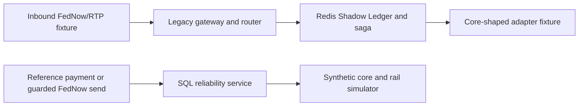

<p align="center">
  
</p>

# OpenFedNow — Legacy Core to U.S. Instant Payment Rails

**Open-source reference integration for studying legacy-core and U.S. instant-payment failure handling with synthetic FedNow and RTP fixtures.**

[](LICENSE)
[]()
[]()
[]()
[](https://doi.org/10.5281/zenodo.21114113)

OpenFedNow explores integration between legacy core banking systems and instant payment workflows. It is a reference implementation with synthetic tests; live compatibility and operational benefit remain to be evaluated.

The DOI badge links an archive record; use the commit-specific [evaluation report](docs/reliability/evaluation-report.md) to assess this checkout's behavior.

> **Evaluation scope: synthetic FedNow routing.** Outbound RTP is disabled; screening failures reject by default; downtime sends default to disabled. On the legacy path, an unknown outbound rail outcome keeps the reservation and requires review. The separate SQL reliability path adds synthetic status inquiry and recovery; live status authority remains unverified. See the [capability matrix](docs/capability-matrix.md) and [reliability evaluation](docs/reliability/evaluation-report.md).

> **Sandbox / reference implementation.** Routing, vendor-shaped adapters, saga lifecycle, idempotency, reconciliation, screening, cancellation, rate limiting, and admin audit have synthetic test coverage. Passing tests do not establish atomic money movement across Redis and SQL, live rail connectivity, vendor compatibility, or production readiness. See [reliability scope](docs/reliability/scope.md), [docs/known-limitations.md](docs/known-limitations.md), and [Production Boundaries](#production-boundaries).

---

## What works today

| Component | Status |
|-----------|--------|
| Five-layer architecture | ✅ Implemented |
| ISO 20022 message models (pacs.008, pacs.002, pacs.004, camt.056/029) | ✅ Implemented |
| Cancellation handling — inbound camt.056 → camt.029 with state-keyed decision matrix | ✅ Implemented on both rails; CNCL reverses Shadow Ledger credit and terminates saga. See [ADR-0007](docs/adr/0007-camt056-cancellation-lifecycle.md) |
| Fraud pre-screening — `FraudScreeningPort` with rule-based default (amount cap, debtor velocity, denylist) | ✅ Disabled by default; opt-in via `openfednow.fraud.enabled=true`. BLOCK returns RJCT before financial effects; screening timeout/error returns TS01 by default. Institutions swap in their own port for production. See [ADR-0008](docs/adr/0008-fraud-screening.md) |
| SandboxAdapter — all scenarios: ACSC, RJCT, ACSP, timeout | ✅ Implemented |
| MockVendorAdapter — in-memory balance ledger, configurable failure modes | ✅ Implemented; `CoreBankingAdapterContractTest` enforces adapter contract |
| `CoreBankingAdapter` contract | ✅ Implemented |
| Shadow Ledger — Redis-backed, WATCH/MULTI/EXEC optimistic locking | ✅ Implemented + tested |
| Shadow Ledger endpoint wiring (inbound + outbound) | ✅ Implemented |
| Maintenance-window bridge fixture | ✅ Local queue/reconciliation behavior tested; continuous live availability unverified |
| Reconciliation — local replay and comparison after fixture core returns | ✅ Implemented and tested with synthetic dependencies |
| Reconciliation pagination — keyset-paginated account scan | ✅ Configurable batch size (default 500); institution-scale memory behavior not benchmarked |
| Saga orchestration — compensation on core rejection | ✅ Implemented + tested |
| Idempotency — Redis + PostgreSQL dual-write, 48h window | ✅ Implemented + tested in legacy sandbox; cross-store effect atomicity unproven |
| Local Redis concurrent debit guard | ✅ Race tests cover watched-key updates; cross-channel overdraft prevention unverified |
| Send-side (outbound) payment flow | SQL synthetic reference slice and opt-in non-production `/fednow/send` bridge implemented; legacy Redis/SQL gateway path disabled by default; no live rail/core authorization established |
| Payment returns (pacs.004 outbound) | Synthetic client shape exists, but `/fednow/return` is disabled by default; no durable return outcome lifecycle is established. HTTP return submission makes one attempt and propagates uncertainty. |
| Admin auth — HTTP Basic on `/admin/*` | ✅ Implemented as reference configuration |
| Admin audit log — every `/admin/**` access recorded to PostgreSQL | ✅ Implemented; both GRANTED and DENIED captured, surfaced via `GET /admin/audit-log`. Sensitive query parameters (`token`, `apikey`, `password`, …) are rewritten to `REDACTED` before persistence by `PiiRedactor` |
| PII redaction in structured logs | ✅ Account numbers masked to last 4 in `MessageRouter` insufficient-funds log, `ShadowLedger` / `ReconciliationService` discrepancy log; single policy source in `io.openfednow.security.pii.PiiRedactor` |
| Rotatable admin credentials — file-backed source | ✅ Set `openfednow.admin.credential-file` to a two-line file; re-read on every login (mtime-cached). A K8s Secret mount can be rotated in place without a pod restart |
| Bridge-mode send policy — receive-only on-ramp | ✅ `openfednow.bridge-mode.allow-sends` (default `false` in every shipped profile). When off, outbound sends during a maintenance window are rejected with ISO 20022 `TS01` (SystemUnavailable) and increment `bridge_mode.sends.blocked` |
| Currency guard — reject non-USD at ingress | ✅ Inbound and outbound sends in a currency the rail cannot settle (currently USD-only for both FedNow and RTP) are rejected with ISO 20022 `AM03` before any saga init, fraud screen, or ledger touch |
| Correlate saga_state ↔ admin_audit_log via request-id | ✅ V7 migration adds `request_id` to `saga_state` and `reconciliation_run`; `SagaOrchestrator.initiate` and `ReconciliationService.reconcile` stamp `MDC[requestId]` so any admin-initiated saga is one JOIN from its audit row |
| Admin query endpoints — saga state, balances, reconciliation history | ✅ `GET /admin/sagas[/{txId}]`, `/admin/accounts/{id}/balance`, `/admin/reconciliation-runs[/{id}]`, `/admin/audit-log` |
| Saga recovery on application restart | ✅ `ApplicationReadyEvent` listener; unknown legacy rail outcomes remain quarantined for review |
| Saga timeout monitor — auto-compensate stalled sagas | ✅ `@Scheduled` sweep; ISO 20022 `XPIR` reason; `saga.timeout` Micrometer counter |
| Balance seeding from core on startup | ✅ Configurable account list seeded via SETNX; `POST /admin/shadow-ledger/seed` for on-demand re-seed |
| Idempotency cleanup — scheduled sweep of expired Postgres rows | ✅ Configurable TTL (default 48h) and sweep cadence (default 60min) |
| Rate limiting — per-client on `/fednow/**` and `/rtp/**` POSTs | ✅ Resilience4j `RateLimiter` per IP / X-Forwarded-For; 429 + Retry-After; `gateway.rate_limited` counter |
| Saga compensation retry — sweeps FAILED sagas with missing REVERSAL rows | ✅ `@Scheduled` retry; idempotent reversal primitives; `saga.compensation.retry.succeeded` and `.failed` counters |
| Admin audit log retention — scheduled cleanup of `admin_audit_log` | ✅ Configurable retention (default 365 days) and sweep cadence |
| Transactional boundaries — multi-statement writes commit atomically | ✅ `@Transactional` on `SagaOrchestrator.compensate` / `cancelInboundSaga`; `TransactionTemplate`-wrapped per-account reconciliation |
| Idempotent Shadow Ledger reversals — safe under retry | ✅ `reverseDebit` and `reverseCredit` skip on existing REVERSAL row; one-call semantics from any caller |
| Default-credential startup guard | ✅ `@PostConstruct` check refuses to start the `prod` profile if admin credentials are still the sandbox defaults |
| HTTP security headers — HSTS, X-Content-Type-Options, X-Frame-Options, Cache-Control | ✅ Configured in `SecurityConfig`; verified end-to-end via `SecurityHeadersTest` |
| CORS — deny-by-default for server-to-server API | ✅ Explicit empty `CorsConfigurationSource`; institutions registering a browser-origin allow-list override the bean |
| Graceful shutdown — drain in-flight requests on SIGTERM | ✅ `server.shutdown=graceful` + 30s drain window; Helm `terminationGracePeriodSeconds: 60` |
| HikariCP pool configuration | ✅ Pool 50 / min-idle 10 / 5s connection timeout in the production profile; no capacity benchmark or live sizing validation |
| Outbound FedNow transfer uncertainty | ✅ Legacy credit transfer attempts once and quarantines a missing status; the SQL reference slice adds durable holds and inquiry. Return submissions attempt once but have no durable lifecycle, so the return gateway stays disabled. |
| Fraud screening timeout — hard cap on port calls | ✅ `CompletableFuture` deadline (default 1500ms); rejects on timeout / exception by default |
| Atomic velocity counter — single Redis Lua script | ✅ `INCR` + `EXPIRE` in one round-trip; sliding window matching the documented semantic |
| Reconcile concurrency guard — same-JVM serialization | ✅ `ReentrantLock` with tryLock; second concurrent call returns "Skipped" report rather than racing |
| Saga source-rail tracking — dual-rail dispatch foundation | ✅ `source_rail` column on `saga_state` (V5); both gateways thread `Rail` through `MessageRouter` |
| Dependency scanning — Dependabot + Trivy | ✅ Weekly Maven + Actions updates; Trivy scan fails the build on HIGH/CRITICAL findings |
| CI — unit + integration test jobs | ✅ Unit and Testcontainers-backed integration jobs passed for [merged PR #87](https://github.com/danielsmori/open-fednow/pull/87); the reliability slice is now on `main` |
| Dual-rail inbound reference routing | ✅ Shared legacy router with persisted source rail; RTP outbound disabled and live rail parity unverified |
| RTP Layer 1 — inbound XML, outbound XML, TCH cert validation hook, sandbox + HTTP client | Inbound reference routing and transport utilities implemented; `/rtp/send` disabled pending financial-control parity |
| Optional Kafka event bus — `PaymentEventPublisher`, 6 event types | ✅ Implemented (disabled by default; no Kafka required) |
| Kafka publish DLQ — failed publishes routed to a dead-letter topic | ✅ `<topic>.dlq` (configurable) with `X-DLQ-Original-Topic` + `X-DLQ-Reason` headers; `events.publish.failed` / `events.publish.dlq_failed` counters |
| Event schema versioning — `schemaVersion` field + `X-Schema-Version` / `X-Event-Type` headers | ✅ Implemented; JSON Schema in `docs/event-schemas/`; strategy documented in [ADR-0006](docs/adr/0006-event-schema-versioning.md) |
| Vendor-shaped adapters (Fiserv, FIS, Jack Henry) | Local REST/JSON or SOAP construction, authentication and response-mapping tests against WireMock fixtures. No vendor-environment or product-compatibility validation; see [capability contract](docs/reliability/adapter-capabilities-v1.md). |
| FedNow JWS message signing — outbound RS256 detached signature + inbound verification | ✅ Implemented per RFC 7515 + RFC 7797 with `b64=false`; opt-in via `openfednow.fednow.signing.enabled=true`. See [ADR-0009](docs/adr/0009-fednow-jws-message-signing.md) |
| Live FedNow connectivity (Fed PKI, mTLS) | 🔲 Credential/certification-dependent; simulator-compatible HTTP client implemented |
| Live RTP connectivity (TCH network, TCH PKI certificates) | 🔲 TCH onboarding, applicable specifications and certification required; local XML and HTTP utilities do not establish a live pipeline |

See [docs/known-limitations.md](docs/known-limitations.md) for the full gap analysis.

---

## Quick start

Requires JDK 17+, Maven and Docker with Compose. The default application profile uses PostgreSQL, Redis and RabbitMQ from `docker-compose.yml`:

```sh
git clone https://github.com/danielsmori/open-fednow.git
cd open-fednow
docker compose up -d postgres redis rabbitmq
mvn spring-boot:run
```

The local health route is `http://localhost:8080/fednow/health`; `http://localhost:8080/demo/` is a synthetic browser demonstration. The optional `./demo/run-demo.sh` exercises legacy outbound and return examples and requires starting the app with `LEGACY_OUTBOUND_SANDBOX_ENABLED=true LEGACY_RETURN_SANDBOX_ENABLED=true` in a **local sandbox**. Those routes are disabled by default. The reliability bridge is a separate opt-in non-production path; see [reproduction instructions](docs/reliability/reproduce.md).

Default tests run without Docker; tagged integration tests require Docker:

```sh
mvn test
mvn test -Dgroups=integration -DexcludedGroups=
```

The [September 29 evaluation report](docs/reliability/evaluation-report.md) records the exact tested source and results. Its full external evaluator runs with `python3 scripts/evaluate.py --integration --negative-control --external` after starting the Compose dependencies.

---

## Architecture

The legacy inbound reference route passes a gateway message to the shared router, core-shaped adapter, Redis Shadow Ledger and saga/reconciliation components. The outbound RTP route and legacy FedNow send/return effects are disabled by default. A separate SQL reliability service owns synthetic outbound holds, attempt intents and final financial effects; the guarded `/fednow/send` evaluation bridge delegates to that service without calling the legacy router or vendor adapters.


```mermaid
flowchart LR
  A[Inbound FedNow/RTP fixture] --> B[Legacy gateway and router]
  B --> C[Redis Shadow Ledger and saga]
  C --> D[Core-shaped adapter fixture]
  E[Reference payment or guarded FedNow send] --> F[SQL reliability service]
  F --> G[Synthetic core and rail simulator]
```

Neither branch represents a certified live rail integration. See [current architecture](docs/architecture.md) and [reliability architecture](docs/reliability/architecture.md).

## ISO 20022-shaped models

The repository contains selected `pacs.008`, `pacs.002`, `pacs.004`, `camt.056` and `camt.029` Java models. Local fields and serialization tests do not establish a complete FedNow, RTP or PIX message profile. The SQL reliability harness uses a smaller JSON protocol that is not a FedNow transport or pacs.028 mapping. See [message mapping boundaries](docs/iso20022-mapping.md).

---

## Architectural Background

PIX, FedNow, and RTP all raise legacy-to-real-time integration questions, but their rules, messages, access, and controls differ. This repository is an independent synthetic implementation; it does not disclose or verify any person's work on a proprietary PIX platform.

---

## Repository map

| Path | Purpose |
|---|---|
| `src/main/java/io/openfednow/gateway/` | Inbound reference gateways and guarded outbound entry points |
| `src/main/java/io/openfednow/reliability/` | Synthetic SQL payment ownership, holds, inquiry and recovery |
| `src/main/java/io/openfednow/acl/` | Core-shaped interface and locally tested adapters |
| `src/main/java/io/openfednow/shadowledger/` | Legacy Redis ledger and reconciliation experiment |
| `src/main/resources/db/migration/` | Additive Flyway migrations V1–V12 |
| `harness/` | External scenario contract, independent rail simulator and separate Python target |
| `docs/reliability/` | Scope, architecture, capability matrix, reproduction and evidence |
| `.github/workflows/` | CI and dependency scanning |

## Production Boundaries

The repository contains reference implementations and synthetic tests. Remaining work includes internal correctness gaps as well as external onboarding dependencies:

- **Submission uncertainty:** the new `/reference/v1/payments` synthetic path persists scoped ownership, a hold and attempt intent in SQL, exposes pending lookup, and can reconcile against its separate simulator. The legacy `/fednow/send` and `/fednow/return` effects are disabled by default because their cross-store/core and return controls remain unsafe. An explicit non-production evaluation flag can instead route `/fednow/send` through the same SQL reliability service as `/reference/v1/payments`; an independent sandbox-only flag retains the old demonstration. None of these paths maps to live FedNow without restricted specifications and institution controls.
- **Outbound RTP:** disabled until screening, reservations, idempotency, and reconciliation are validated on its actual routing path.
- **Rail connectivity:** actual transports, message profiles, credentials, certification, and institution-specific operational controls require verification. A configured HTTP client is not certification.
- **Vendor adapters:** mock-tested request construction is not vendor verification or confirmed compatibility.
- **Screening and downtime:** rule-based screening is optional and is not an AI or sanctions engine. A configured screen's timeout/error rejects by default; downtime sends default to disabled. Cross-channel balance correctness remains unproven.

See [capability matrix](docs/capability-matrix.md) for the boundary of each claim.

---

## Known Limitations

See [docs/known-limitations.md](docs/known-limitations.md) for the full analysis. Key architectural boundaries:

- **Cross-store consistency remains unverified.** Redis WATCH detects changes by other clients, but Redis balance updates and SQL audit writes do not form one atomic transaction. See [known limitations](docs/known-limitations.md).
- **Admin credentials default to `admin` / `changeme` in dev / sandbox.** A `@PostConstruct` check in `SecurityConfig` refuses to start the application under `spring.profiles.active=prod` if `ADMIN_USERNAME` / `ADMIN_PASSWORD` are still at their defaults, so a misconfigured production deployment fails loud at boot rather than silently shipping with default credentials.
- **Post-reconciliation returns remain an unverified design.** The sandbox models a return after a provisionally accepted transaction, but the deployed/live effect and legal or customer-visible outcome have not been established. The return gateway is disabled by default; see [ADR-0003](docs/adr/0003-provisional-acceptance-acsp.md).
- **Outbound camt.056 not yet implemented.** Inbound cancellation handling is complete (camt.056 → camt.029 with state-keyed decision matrix). Initiating a cancellation against our own outbound payment is tracked as future work.

---

## Roadmap

**Phase 1 — Core reference framework implemented**
- Five-layer architecture: Shadow Ledger, SyncAsyncBridge, Saga orchestration, idempotency, reconciliation
- ISO 20022 message models — pacs.008 / pacs.002 / pacs.004 / camt.056 / camt.029
- `MockVendorAdapter` + `CoreBankingAdapterContractTest` baseline; sandbox scenario routing

**Phase 2 — Fiserv + FIS reference adapters implemented; vendor validation open**
- Fiserv and FIS reference adapter request/response shapes, tested locally with mocks; institution-specific products and compatibility remain unverified

**Phase 3 — Jack Henry reference adapter implemented; vendor validation open**
- Jack Henry jXchange-shaped reference SOAP adapter, locally tested; product-specific compatibility remains unverified
- Three vendor-shaped reference adapters implemented; the repo does not establish coverage of any percentage of U.S. institutions

**Phase 3b — RTP reference transport utilities implemented; live validation open**
- RTP reference transport utilities (outbound gateway initiation disabled): `RtpXmlParser`, `RtpXmlSerializer`, `RtpClient` with sandbox + HTTP implementations, TCH certificate-validation hook
- `RtpGateway` inbound XML route and outbound transport utilities present; `/rtp/send` remains disabled ([ADR-0005](docs/adr/0005-dual-rail-architecture-fednow-rtp.md))

**Phase 4 — Sandbox operational tooling implemented; institution validation open**
- Saga lifecycle: source-rail tracking, restart-time recovery, timeout monitor with `XPIR` compensation, compensation retry for failed reversals
- Admin endpoints: saga state queries, account balance views, reconciliation history, audit log; all under HTTP Basic + `ADMIN` role
- Admin access auditing with retention sweep; idempotency TTL cleanup; balance seeding from core on startup
- Cancellation handling — camt.056 → camt.029 with state-keyed decision matrix ([ADR-0007](docs/adr/0007-camt056-cancellation-lifecycle.md))
- Fraud screening port with rule-based default ([ADR-0008](docs/adr/0008-fraud-screening.md))
- Per-client rate limiting on `/fednow/**` and `/rtp/**`; reconciliation pagination for large institutions
- Event schema versioning ([ADR-0006](docs/adr/0006-event-schema-versioning.md))

**Phase 5 — Reference hardening controls implemented; production validation open**
- Transactional boundaries on multi-statement writes; idempotent Shadow Ledger reversals; atomic Lua velocity counter; same-JVM reconcile concurrency guard
- HSTS, deny-by-default CORS, default-credential startup guard in prod profile
- Graceful shutdown with bounded drain window; configurable HikariCP pool (no FedNow capacity benchmark)
- Outbound FedNow credit transfers make one HTTP attempt and quarantine unknown outcomes; hard timeout on `FraudScreeningPort` calls (fail-closed by default; explicit fail-open option)
- Dependabot + Trivy workflow; GitHub Actions CI with both unit and integration test jobs

**Phase 6 — Reference signing components implemented; live profile unverified**
- RS256 detached JWS message signing implemented per RFC 7515 + RFC 7797 ([ADR-0009](docs/adr/0009-fednow-jws-message-signing.md))
- Outbound: `FedNowJwsSigner` + RestTemplate interceptor attaches a locally defined `X-JWS-Signature` when enabled
- Inbound: `JwsInboundVerificationFilter` verifies locally shaped signatures when enabled
- Opt-in via `openfednow.fednow.signing.enabled=true`; sandbox / demo flow unchanged
- Live mapping also requires applicable restricted message and transport specifications, status authority verification, inquiry behavior, institutional controls, and certification; a certificate and URL alone are insufficient.

**Phase 7 — Synthetic SQL reliability evaluation merged in [PR #87](https://github.com/danielsmori/open-fednow/pull/87)**
- SQL-scoped operation ownership, holds, possible-send intent, inquiry and final effect tracking for synthetic accounts
- Controlled non-production bridge from `/fednow/send`; legacy Redis/SQL and return paths remain disabled by default
- External scenario oracle across four configurations, with separate fault, restart and two-process cases; [measured report](docs/reliability/evaluation-report.md) and [evidence bundle](docs/reliability/evidence/candidate-2026-09-29/README.md)

**Open work**
- Live FedNow / RTP connectivity (institutional credentials — see Production Boundaries)
- Cross-process, cross-store and other-channel funds correctness for the legacy Shadow Ledger ([#40](https://github.com/danielsmori/open-fednow/issues/40))
- Distributed tracing across MDC, RabbitMQ, and Kafka boundaries
- Operational runbooks for the standard incident-response scenarios

---

## Contributing

Contributions are welcome. See [CONTRIBUTING.md](CONTRIBUTING.md) for guidelines.

Areas where contributions are especially valuable:
- Core banking vendor adapter implementations
- ISO 20022 message validation
- Test coverage for Saga compensation logic
- Documentation and integration guides

---

## License

This project is licensed under the **Apache License 2.0**. See [LICENSE](LICENSE) for the full text.

Apache 2.0 permits reuse under its stated terms; it does not establish suitability for any institution's payment operations.

---

## References

- Federal Reserve. [FedNow Service](https://www.frbservices.org/financial-services/fednow). Federal Reserve Financial Services, 2023.
- Federal Reserve Bank of Kansas City. *Market Structure of Core Banking Services Providers*. March 2024.
- U.S. Faster Payments Council / Finzly. *Faster Payments Barometer*. 2024.
- ISO 20022. [Financial Services — Universal Financial Industry Message Scheme](https://www.iso20022.org). International Organization for Standardization.
- Banco Central do Brasil. [PIX — Sistema de Pagamentos Instantâneos](https://www.bcb.gov.br/estabilidadefinanceira/pix). 2020.
