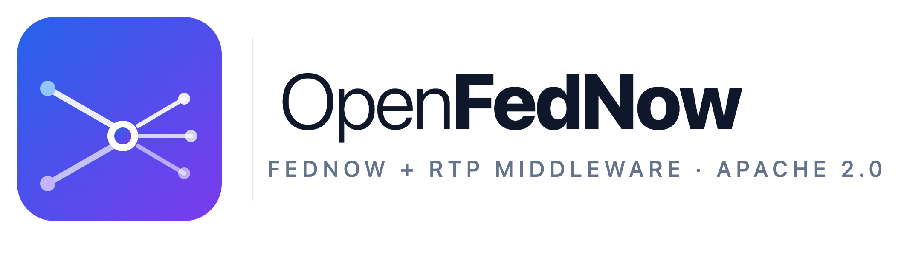
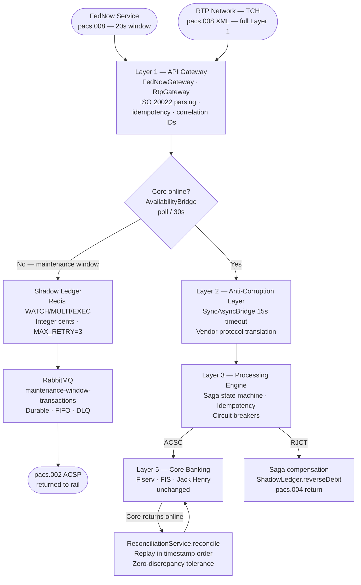

<p align="center">
  
</p>

# OpenFedNow — Legacy Core to U.S. Instant Payment Rails

**Open-source reference integration for studying legacy-core and U.S. instant-payment failure handling with synthetic FedNow and RTP fixtures.**

[](LICENSE)
[]()
[]()
[]()
[](https://doi.org/10.5281/zenodo.21114113)

OpenFedNow explores integration between legacy core banking systems and instant payment workflows. It is a reference implementation with synthetic tests; live compatibility and operational benefit remain to be evaluated.

> **Evaluation scope: synthetic FedNow routing.** Outbound RTP is disabled; screening failures reject by default; downtime sends default to disabled. An unknown outbound rail outcome now keeps the reservation and requires review; automated rail status verification remains unfinished. See the [capability matrix](docs/capability-matrix.md) and [reproducible evaluation](docs/evaluation.md).

> **Sandbox / reference implementation.** Routing, vendor-shaped adapters, saga lifecycle, idempotency, reconciliation, screening, cancellation, rate limiting, and admin audit have synthetic test coverage. Passing tests do not establish atomic money movement across Redis and SQL, live rail connectivity, vendor compatibility, or production readiness. See [reliability scope](docs/reliability/scope.md), [docs/known-limitations.md](docs/known-limitations.md), and [Production Boundaries](#production-boundaries).

---

## What works today

| Component | Status |
|-----------|--------|
| Five-layer architecture | ✅ Implemented |
| ISO 20022 message models (pacs.008, pacs.002, pacs.004, camt.056/029) | ✅ Implemented |
| Cancellation handling — inbound camt.056 → camt.029 with state-keyed decision matrix | ✅ Implemented on both rails; CNCL reverses Shadow Ledger credit and terminates saga. See [ADR-0007](docs/adr/0007-camt056-cancellation-lifecycle.md) |
| Fraud pre-screening — `FraudScreeningPort` with rule-based default (amount cap, debtor velocity, denylist) | ✅ Disabled by default; opt-in via `openfednow.fraud.enabled=true`. BLOCK returns RJCT before financial effects; screening timeout/error returns TS01 by default. Institutions swap in their own port for production. See [ADR-0008](docs/adr/0008-fraud-screening.md) |
| SandboxAdapter — all scenarios: ACSC, RJCT, ACSP, timeout | ✅ Implemented |
| MockVendorAdapter — in-memory balance ledger, configurable failure modes | ✅ Implemented; `CoreBankingAdapterContractTest` enforces adapter contract |
| `CoreBankingAdapter` contract | ✅ Implemented |
| Shadow Ledger — Redis-backed, WATCH/MULTI/EXEC optimistic locking | ✅ Implemented + tested |
| Shadow Ledger endpoint wiring (inbound + outbound) | ✅ Implemented |
| 24/7 Bridge Mode — queues payments during core maintenance window | ✅ Implemented + tested |
| Reconciliation — replay and sync after core returns online | ✅ Implemented + tested |
| Reconciliation pagination — keyset-paginated account scan for large institutions | ✅ Configurable batch size (default 500); memory stays flat regardless of pending-account count |
| Saga orchestration — compensation on core rejection | ✅ Implemented + tested |
| Idempotency — Redis + PostgreSQL dual-write, 48h window | ✅ Implemented + tested in legacy sandbox; cross-store effect atomicity unproven |
| Concurrent overdraft prevention under load | ✅ Tested (race-condition suite) |
| Send-side (outbound) payment flow | Synthetic reference slice implemented; legacy gateway disabled by default; no live rail/core authorization established |
| Payment returns (pacs.004 outbound) | Synthetic client shape exists, but `/fednow/return` is disabled by default; no durable return outcome lifecycle is established. HTTP return submission makes one attempt and propagates uncertainty. |
| Admin auth — HTTP Basic on `/admin/*` | ✅ Implemented as reference configuration |
| Admin audit log — every `/admin/**` access recorded to PostgreSQL | ✅ Implemented; both GRANTED and DENIED captured, surfaced via `GET /admin/audit-log`. Sensitive query parameters (`token`, `apikey`, `password`, …) are rewritten to `REDACTED` before persistence by `PiiRedactor` |
| PII redaction in structured logs | ✅ Account numbers masked to last 4 in `MessageRouter` insufficient-funds log, `ShadowLedger` / `ReconciliationService` discrepancy log; single policy source in `io.openfednow.security.pii.PiiRedactor` |
| Rotatable admin credentials — file-backed source | ✅ Set `openfednow.admin.credential-file` to a two-line file; re-read on every login (mtime-cached). A K8s Secret mount can be rotated in place without a pod restart |
| Bridge-mode send policy — receive-only on-ramp | ✅ `openfednow.bridge-mode.allow-sends` (default `false` in every shipped profile). When off, outbound sends during a maintenance window are rejected with ISO 20022 `TS01` (SystemUnavailable) and increment `bridge_mode.sends.blocked` |
| Currency guard — reject non-USD at ingress | ✅ Inbound and outbound sends in a currency the rail cannot settle (currently USD-only for both FedNow and RTP) are rejected with ISO 20022 `AM03` before any saga init, fraud screen, or ledger touch |
| Correlate saga_state ↔ admin_audit_log via request-id | ✅ V7 migration adds `request_id` to `saga_state` and `reconciliation_run`; `SagaOrchestrator.initiate` and `ReconciliationService.reconcile` stamp `MDC[requestId]` so any admin-initiated saga is one JOIN from its audit row |
| Admin query endpoints — saga state, balances, reconciliation history | ✅ `GET /admin/sagas[/{txId}]`, `/admin/accounts/{id}/balance`, `/admin/reconciliation-runs[/{id}]`, `/admin/audit-log` |
| Saga recovery on application restart | ✅ `ApplicationReadyEvent` listener; dispatches each non-terminal saga by state (compensate, advance, finalize) |
| Saga timeout monitor — auto-compensate stalled sagas | ✅ `@Scheduled` sweep; ISO 20022 `XPIR` reason; `saga.timeout` Micrometer counter |
| Balance seeding from core on startup | ✅ Configurable account list seeded via SETNX; `POST /admin/shadow-ledger/seed` for on-demand re-seed |
| Idempotency cleanup — scheduled sweep of expired Postgres rows | ✅ Configurable TTL (default 48h) and sweep cadence (default 60min) |
| Rate limiting — per-client on `/fednow/**` and `/rtp/**` POSTs | ✅ Resilience4j `RateLimiter` per IP / X-Forwarded-For; 429 + Retry-After; `gateway.rate_limited` counter |
| Saga compensation retry — sweeps FAILED sagas with missing REVERSAL rows | ✅ `@Scheduled` retry; idempotent reversal primitives; `saga.compensation.retry.succeeded` and `.failed` counters |
| Admin audit log retention — scheduled cleanup of `admin_audit_log` | ✅ Configurable retention (default 365 days) and sweep cadence |
| Transactional boundaries — multi-statement writes commit atomically | ✅ `@Transactional` on `SagaOrchestrator.compensate` / `cancelInboundSaga`; `TransactionTemplate`-wrapped per-account reconciliation |
| Idempotent Shadow Ledger reversals — safe under retry | ✅ `reverseDebit` and `reverseCredit` skip on existing REVERSAL row; one-call semantics from any caller |
| Default-credential startup guard | ✅ `@PostConstruct` check refuses to start the `prod` profile if admin credentials are still the sandbox defaults |
| HTTP security headers — HSTS, X-Content-Type-Options, X-Frame-Options, Cache-Control | ✅ Configured in `SecurityConfig`; verified end-to-end via `SecurityHeadersTest` |
| CORS — deny-by-default for server-to-server API | ✅ Explicit empty `CorsConfigurationSource`; institutions registering a browser-origin allow-list override the bean |
| Graceful shutdown — drain in-flight requests on SIGTERM | ✅ `server.shutdown=graceful` + 30s drain window; Helm `terminationGracePeriodSeconds: 60` |
| HikariCP tuning — prod-sized connection pool | ✅ Configured pool 50 / min-idle 10 / 5s connection timeout; no capacity benchmark or live sizing validation |
| Outbound FedNow transfer uncertainty | ✅ Legacy credit transfer attempts once and quarantines a missing status; the SQL reference slice adds durable holds and inquiry. Return submissions attempt once but have no durable lifecycle, so the return gateway stays disabled. |
| Fraud screening timeout — hard cap on port calls | ✅ `CompletableFuture` deadline (default 1500ms); rejects on timeout / exception by default |
| Atomic velocity counter — single Redis Lua script | ✅ `INCR` + `EXPIRE` in one round-trip; sliding window matching the documented semantic |
| Reconcile concurrency guard — same-JVM serialization | ✅ `ReentrantLock` with tryLock; second concurrent call returns "Skipped" report rather than racing |
| Saga source-rail tracking — dual-rail dispatch foundation | ✅ `source_rail` column on `saga_state` (V5); both gateways thread `Rail` through `MessageRouter` |
| Dependency scanning — Dependabot + Trivy | ✅ Weekly Maven + Actions updates; Trivy scan fails the build on HIGH/CRITICAL findings |
| CI — unit + integration test jobs | ✅ Workflow runs unit and Testcontainers-backed integration jobs on PRs targeting `main`; stacked development PRs have no checks until retargeted |
| Dual-rail architecture (FedNow + RTP) | ✅ ISO 20022 foundation; Layer 1 varies, Layers 2–4 rail-agnostic; source rail persisted on `saga_state` |
| RTP Layer 1 — inbound XML, outbound XML, TCH cert validation hook, sandbox + HTTP client | Inbound reference routing and transport utilities implemented; `/rtp/send` disabled pending financial-control parity |
| Optional Kafka event bus — `PaymentEventPublisher`, 6 event types | ✅ Implemented (disabled by default; no Kafka required) |
| Kafka publish DLQ — failed publishes routed to a dead-letter topic | ✅ `<topic>.dlq` (configurable) with `X-DLQ-Original-Topic` + `X-DLQ-Reason` headers; `events.publish.failed` / `events.publish.dlq_failed` counters |
| Event schema versioning — `schemaVersion` field + `X-Schema-Version` / `X-Event-Type` headers | ✅ Implemented; JSON Schema in `docs/event-schemas/`; strategy documented in [ADR-0006](docs/adr/0006-event-schema-versioning.md) |
| Vendor adapters (Fiserv, FIS, Jack Henry) | Reference implementations — OAuth 2.0 authentication, vendor error code → ISO 20022 mapping, WireMock integration test suite. Fiserv + FIS via REST/JSON. Jack Henry via jXchange SOAP posting a balanced two-leg `TrnAdd` (DDA credit + settlement GL debit) per the jXchange Creating Balanced Transactions doc — updated following preliminary feedback relayed by Jack Henry developer relations; the correction has not been verified by Jack Henry. Mock request assertions establish regression coverage only. |
| FedNow JWS message signing — outbound RS256 detached signature + inbound verification | ✅ Implemented per RFC 7515 + RFC 7797 with `b64=false`; opt-in via `openfednow.fednow.signing.enabled=true`. See [ADR-0009](docs/adr/0009-fednow-jws-message-signing.md) |
| Live FedNow connectivity (Fed PKI, mTLS) | 🔲 Credential/certification-dependent; simulator-compatible HTTP client implemented |
| Live RTP connectivity (TCH network, TCH PKI certificates) | 🔲 TCH onboarding/certification-dependent; `HttpRtpClient` and full XML pipeline implemented |

See [docs/known-limitations.md](docs/known-limitations.md) for the full gap analysis.

---

## Architecture


```mermaid
flowchart TD
    FN([FedNow Service\npacs.008 — 20s window])
    RTP([RTP Network — TCH\npacs.008 XML — full Layer 1])

    FN  --> GW["Layer 1 — API Gateway\nFedNowGateway · RtpGateway\nISO 20022 parsing · idempotency · correlation IDs"]
    RTP --> GW

    GW --> CHK{Core online?\nAvailabilityBridge\npoll / 30s}

    CHK -->|Yes| ACL["Layer 2 — Anti-Corruption Layer\nSyncAsyncBridge 15s timeout\nVendor protocol translation"]
    CHK -->|No — maintenance window| SL["Shadow Ledger\nRedis WATCH/MULTI/EXEC\nInteger cents · MAX_RETRY=3"]

    SL --> MQ["RabbitMQ\nmaintenance-window-transactions\nDurable · FIFO · DLQ"]
    MQ --> ACSP([pacs.002 ACSP\nreturned to rail])

    ACL --> PE["Layer 3 — Processing Engine\nSaga state machine · Idempotency\nCircuit breakers"]

    PE -->|ACSC| CORE["Layer 5 — Core Banking\nFiserv · FIS · Jack Henry\nunchanged"]
    PE -->|RJCT| COMP["Saga compensation\nShadowLedger.reverseDebit\npacs.004 return"]

    CORE -->|Core returns online| RECON["ReconciliationService.reconcile\nReplay in timestamp order\nZero-discrepancy tolerance"]
    RECON --> CORE
```

---

## Key documents

| Document | What it answers |
|----------|-----------------|
| [docs/known-limitations.md](docs/known-limitations.md) | Current implementation boundaries, credential-dependent live connectivity, and production-readiness gaps |
| [docs/rtp-compatibility.md](docs/rtp-compatibility.md) | RTP inbound reference routing, disabled outbound initiation, and unverified live connectivity |
| [docs/shadow-ledger.md](docs/shadow-ledger.md) | How the Shadow Ledger works, failure modes |
| [docs/saga-pattern.md](docs/saga-pattern.md) | Compensation path when core rejects post-ACSP |
| [docs/event-schemas/README.md](docs/event-schemas/README.md) | Kafka domain event schema versioning policy |
| [docs/adr/0001-optimistic-locking-shadow-ledger-debits.md](docs/adr/0001-optimistic-locking-shadow-ledger-debits.md) | Why WATCH/MULTI/EXEC, the Lettuce caveat |
| [docs/adr/0003-provisional-acceptance-acsp.md](docs/adr/0003-provisional-acceptance-acsp.md) | Why ACSP is returned, the exposure window |
| [docs/adr/0004-eventual-consistency-shadow-ledger-and-core.md](docs/adr/0004-eventual-consistency-shadow-ledger-and-core.md) | Why eventual consistency, why not 2PC |
| [docs/adr/0005-dual-rail-architecture-fednow-rtp.md](docs/adr/0005-dual-rail-architecture-fednow-rtp.md) | Decision: keep Layers 2–4 rail-agnostic |
| [docs/adr/0006-event-schema-versioning.md](docs/adr/0006-event-schema-versioning.md) | Hybrid header + envelope event versioning |
| [docs/adr/0007-camt056-cancellation-lifecycle.md](docs/adr/0007-camt056-cancellation-lifecycle.md) | camt.056 → camt.029 decision matrix keyed on saga state |
| [docs/adr/0008-fraud-screening.md](docs/adr/0008-fraud-screening.md) | Port-based fraud screening with a configurable default rule set |
| [docs/adr/0009-fednow-jws-message-signing.md](docs/adr/0009-fednow-jws-message-signing.md) | RS256 detached JWS with `b64=false` per RFC 7515 + 7797 |

---

## The Problem

The Federal Reserve's FedNow Instant Payment Service launched in July 2023. As of early 2026, only approximately 1,500 of the nation's 10,000+ financial institutions have connected — roughly 16% of the eligible ecosystem.

Legacy integration can involve differences in processing schedules, message formats, and availability. The relevance and severity of each issue depend on the institution and its existing services. The project has not measured the population of banks prevented from sending payments by these issues.

This creates four fundamental incompatibilities:

- **Processing model mismatch** — Legacy systems process in batches; FedNow requires sub-20-second event-driven responses
- **Availability mismatch** — Legacy systems have maintenance windows; FedNow operates 24/7/365
- **Protocol mismatch** — Legacy systems use institution- and vendor-specific interfaces; FedNow messages use ISO 20022 profiles. The project's JSON client is a synthetic transport, not a verified FedNow wire format
- **Concurrency mismatch** — Legacy systems were not designed for high-volume simultaneous transaction loads

The layers below explore these integration concerns. Whether they address a particular institution's constraints requires a scoped evaluation against its actual interfaces and controls.

---

## The Solution

OpenFedNow is a five-layer reference framework that explores these incompatibilities. Institution-specific resolution remains unverified.

The framework separates shared routing and ledger code from vendor adapters. Source-line proportions do not measure integration effort, cost savings, institution coverage, or deployment readiness; those require measured implementation results.

### Core banking adapters

Fiserv-, FIS-, and Jack Henry-shaped adapters illustrate how the shared interface can be implemented and are tested locally with mocks/WireMock. The repository has not verified any product-specific vendor interface, institution compatibility, or market coverage. Historical vendor share estimates cannot establish the number of banks served by these adapters or the impact of this software.

---

## Quick Start

**Prerequisites:** Java 17+, Docker.

```bash
git clone https://github.com/danielsmori/open-fednow
cd open-fednow
docker-compose up -d                   # Postgres + Redis + RabbitMQ
mvn spring-boot:run                    # → http://localhost:8080/demo/
```

Once the app is running (look for `Started OpenFedNowApplication` in the console), verify it's up:

```bash
curl http://localhost:8080/fednow/health
# → OpenFedNow Gateway — operational
```

Then either:

**Option A — browser console:** open <http://localhost:8080/demo/> for the synthetic guided tour. Its legacy outbound and return examples require explicit sandbox-only flags (`LEGACY_OUTBOUND_SANDBOX_ENABLED=true` and `LEGACY_RETURN_SANDBOX_ENABLED=true`); leave those off outside a local demo. The console's “Start live demo” label refers to a local interactive demonstration, not a live rail.

**Option B — shell script** for a scripted end-to-end check:

```bash
./demo/run-demo.sh
```

The shell script runs 13 scenarios covering inbound normal / rejection / provisional, outbound, currency guard (AM03), RTP XML, pacs.004 return, cancellation, reconciliation, saga snapshot with request-id correlation, PII-redacted audit log, and balance view. Prints pass/fail for each.

### What the demo does (step by step)

### 1. Send a payment (core online)

```bash
curl -s -X POST http://localhost:8080/fednow/receive \
  -H "Content-Type: application/json" \
  -d '{
    "messageId":                  "MSG-DEMO-001",
    "endToEndId":                 "E2E-DEMO-001",
    "transactionId":              "TXN-DEMO-001",
    "interbankSettlementAmount":  250.00,
    "interbankSettlementCurrency":"USD",
    "creditorAccountNumber":      "ACC-DEMO-12345"
  }'
```

```json
{"transactionStatus":"ACSC","originalEndToEndId":"E2E-DEMO-001","originalTransactionId":"TXN-DEMO-001"}
```

`ACSC` — AcceptedSettlementCompleted. The sandbox core accepted the transfer.

### 2. Test a rejection scenario

The sandbox adapter routes by `creditorAccountNumber` prefix. No config change needed:

```bash
curl -s -X POST http://localhost:8080/fednow/receive \
  -H "Content-Type: application/json" \
  -d '{
    "messageId":                  "MSG-DEMO-002",
    "endToEndId":                 "E2E-DEMO-002",
    "transactionId":              "TXN-DEMO-002",
    "interbankSettlementAmount":  250.00,
    "interbankSettlementCurrency":"USD",
    "creditorAccountNumber":      "RJCT_FUNDS_ACC-DEMO-67890"
  }'
```

```json
{"transactionStatus":"RJCT","originalEndToEndId":"E2E-DEMO-002","rejectReasonCode":"AM04"}
```

`RJCT / AM04` — Rejected, insufficient funds. Other prefixes: `RJCT_ACCT_` (AC01), `RJCT_CLOSED_` (AC04), `TOUT_` (triggers the ACSP provisional-acceptance path).

### 3. Trigger provisional acceptance (ACSP)

The `TOUT_` prefix makes the sandbox adapter return a TIMEOUT status immediately. The `SyncAsyncBridge` maps this to a provisional acceptance without waiting. No app restart needed:

```bash
curl -s -X POST http://localhost:8080/fednow/receive \
  -H "Content-Type: application/json" \
  -d '{
    "messageId":                  "MSG-DEMO-003",
    "endToEndId":                 "E2E-DEMO-003",
    "transactionId":              "TXN-DEMO-003",
    "interbankSettlementAmount":  300.00,
    "interbankSettlementCurrency":"USD",
    "creditorAccountNumber":      "TOUT_ACC-DEMO-12345"
  }'
```

```json
{"transactionStatus":"ACSP","originalEndToEndId":"E2E-DEMO-003","originalTransactionId":"TXN-DEMO-003"}
```

`ACSP` is the local fixture's AcceptedSettlementInProcess-shaped response. It does not establish a live FedNow status or timing result. The `PEND_` prefix works identically in the fixture. For the maintenance-window experiment, restart the app with `OPENFEDNOW_SANDBOX_CORE_AVAILABLE=false mvn spring-boot:run`.

### 4. Trigger reconciliation

No restart needed — reconcile against the same running instance:

```bash
curl -s -u admin:changeme -X POST http://localhost:8080/admin/reconcile
```

```json
{
  "transactionsReplayed": 0,
  "discrepanciesDetected": 0,
  "reconciliationSuccessful": true,
  "summary": "Clean reconciliation: 0 entries confirmed across all accounts"
}
```

`transactionsReplayed: 0` — H2 in-memory resets on restart, so this run starts with a clean ledger. In a PostgreSQL deployment, bridge-mode transactions accumulated during the offline window appear here as `transactionsReplayed: N`. The reconciliation path is fully exercised in `BridgeModeIntegrationTest` and `ReconciliationServiceIntegrationTest` using Testcontainers.

---

## Synthetic maintenance-window illustration

Annotated log output from the full cycle: core goes offline, payment arrives, core returns, reconciliation runs.

```
# 01:58 — AvailabilityBridge detects core going offline
WARN  [scheduling-1] AvailabilityBridge  Core banking system OFFLINE — entering bridge mode,
                                          transactions will be queued for replay

# 02:03 — $300 payment arrives during maintenance window
INFO  [http-nio-8080-exec-2] MessageRouter  Inbound credit transfer received amount=300.00 currency=USD
INFO  [http-nio-8080-exec-2] AvailabilityBridge  Bridge mode active — queuing inbound payment e2e=E2E-MAINT-001
INFO  [http-nio-8080-exec-2] AvailabilityBridge  Transaction queued for core replay transactionId=E2E-MAINT-001
INFO  [http-nio-8080-exec-2] MessageRouter  Inbound credit transfer status=ACSP rejectCode=null
# → local synthetic ACSP returned in 6ms; this does not establish a valid live-rail response.

# 02:03 — RabbitMQ queue depth: 1
#   maintenance-window-transactions: messages=1, consumers=0

# 05:47 — Core returns online
INFO  [scheduling-1] AvailabilityBridge  Core banking system ONLINE — exiting bridge mode,
                                          reconciliation pending

# 05:47 — Operator triggers reconciliation (or automatic on core-return event)
INFO  [http-nio-8080-exec-5] ReconciliationService  Reconciliation cycle starting
INFO  [http-nio-8080-exec-5] ReconciliationService  Reconciliation found 1 accounts with pending entries
INFO  [http-nio-8080-exec-5] ReconciliationService  Reconciliation cycle complete
                                                      replayed=1 discrepancies=0 success=true

# Response to POST /admin/reconcile
{
  "transactionsReplayed": 1,
  "discrepanciesDetected": 0,
  "reconciliationSuccessful": true,
  "summary": "Clean reconciliation: 1 entries confirmed across all accounts"
}
# shadow_ledger_transaction_log: core_confirmed = TRUE
# Balance in Redis matches core confirmed balance. Divergence window closed.
```

---

## Test coverage

The test suite uses Testcontainers (PostgreSQL + Redis + RabbitMQ) for all integration tests — no mocking of infrastructure.

| Test class | What it covers |
|---|---|
| `ShadowLedgerConcurrencyTest` | 10 concurrent debits, overdraft prevention under race conditions, credit atomicity, audit row count matches successful ops |
| `ReplayOrderingIntegrationTest` | FIFO ordering across 5 queued messages, targeted replay without confirming unlisted entries, poison message → DLQ without blocking queue, idempotent re-replay |
| `BridgeModeIntegrationTest` | Full bridge mode cycle: payment queued during offline window, RabbitMQ message verified, reconciliation run, `core_confirmed` flipped |
| `SagaCompensationIntegrationTest` | Saga initiated → INITIATED state persisted, compensation reverses Shadow Ledger debit, double-compensation is no-op, reason code stored |
| `IdempotencyServiceIntegrationTest` | Redis fast-path dedup, DB fallback when Redis key absent, concurrent `recordOutcome` calls produce exactly one row, 48h TTL |
| `ReconciliationServiceIntegrationTest` | Discrepancy detection → alert + Shadow Ledger overwrite, clean run, multi-account run |
| `RabbitMqDlqTest` | DLQ topology declared on startup, nack-without-requeue routes to DLQ, main queue unaffected |
| `FlywayMigrationTest` | All migrations apply cleanly to a fresh PostgreSQL container |

---

## The Shadow Ledger in Action

The Shadow Ledger is a synthetic bridge experiment for a legacy core maintenance window. Its cached balance cannot prove cross-channel availability, so it does not establish 24/7 FedNow participation.

### The problem it solves

```
Legacy core: offline 2am–6am for batch processing
FedNow:      $300 payment arrives at 3am
Without Shadow Ledger: institution doesn't respond → FedNow marks you unavailable
With Shadow Ledger:    local fixture emits ACSP → live response validity unverified
```

### Concrete behavior, step by step

**Account balance is seeded from the core at startup (stored in Redis as integer cents):**

```bash
$ redis-cli SET balance:ACC-12345 5000000     # $50,000.00
$ redis-cli GET balance:ACC-12345
"5000000"
```

Balances are stored as integer cents — no floating-point arithmetic on money.

---

**Stage 1: 11pm — Core is online. A $250 payment arrives.**

```java
// Inside MessageRouter.routeInbound() when core is available:
shadowLedger.applyDebit("ACC-12345", new BigDecimal("250.00"), "TXN-0001");
```

The debit uses Redis WATCH / MULTI / EXEC — atomic, safe under concurrent load:

```
WATCH  balance:ACC-12345
GET    balance:ACC-12345           → "5000000"
MULTI
  SET  balance:ACC-12345  4975000  ← $50,000 – $250 = $49,750
EXEC                               → success (key unchanged since WATCH)
```

```bash
$ redis-cli GET balance:ACC-12345
"4975000"                          # $49,750.00
```

An audit row is written to PostgreSQL:

```
shadow_ledger_transaction_log:
  transaction_id  = TXN-0001
  type            = DEBIT
  amount          = 250.00
  balance_before  = 50000.00
  balance_after   = 49750.00
  core_confirmed  = FALSE          ← pending core confirmation
```

`pacs.002 ACSC` is returned to FedNow. The core is contacted and confirms.
`core_confirmed` flips to `TRUE`. The Shadow Ledger and core are in sync.

---

**Stage 2: 2am — Core goes offline for scheduled maintenance.**

The `AvailabilityBridge` polls every 30 seconds and detects the transition:

```
[WARN] Core banking system OFFLINE — entering bridge mode,
       transactions will be queued for replay
```

**A $300 payment arrives at 2:47am.**

```java
// AvailabilityBridge.isInBridgeMode() == true
// Balance check passes against Shadow Ledger: $49,750 > $300
shadowLedger.applyDebit("ACC-12345", new BigDecimal("300.00"), "TXN-0002");
availabilityBridge.queueForCoreProcessing("E2E-MAINT-001", serializedPacs008);
```

```bash
$ redis-cli GET balance:ACC-12345
"4945000"                          # $49,450.00 — debit applied to Shadow Ledger

$ curl -s -u guest:guest \
    'http://localhost:15672/api/queues/%2F/maintenance-window-transactions' \
    | python3 -c "import sys,json; q=json.load(sys.stdin); print('queued:', q['messages'])"
queued: 1
```

The local fixture emits an ACSP-shaped status immediately while the core is offline. Its suitability for a live FedNow flow is unverified; the public procedures distinguish settlement from receiver posting.

---

**Stage 3: 6am — Core comes back online.**

```
[INFO] Core banking system ONLINE — exiting bridge mode, reconciliation pending
```

```bash
$ curl -s -u admin:changeme -X POST http://localhost:8080/admin/reconcile
```

```json
{
  "transactionsReplayed": 1,
  "discrepanciesDetected": 0,
  "reconciliationSuccessful": true,
  "summary": "Clean reconciliation: 1 entries confirmed across all accounts"
}
```

The `ReconciliationService`:
1. Finds all accounts with `core_confirmed = FALSE` entries
2. Fetches the authoritative balance from the core for each account
3. If the Shadow Ledger balance matches: marks entries confirmed, done
4. If there's a discrepancy (e.g., the core processed something OpenFedNow didn't know about): overwrites the Shadow Ledger with the core's figure, logs a `RECONCILIATION` row, and alerts — **zero discrepancy tolerance**

```bash
$ redis-cli GET balance:ACC-12345
"4945000"                          # $49,450.00 — confirmed by core
```

The institution was available to FedNow for the entire 4-hour maintenance window. Every payment was accepted and the ledger is correct.

### What protects against overdrafts under concurrent load

Three payments arrive simultaneously at 3am for the same account:

```
Thread 1: WATCH balance:ACC-12345 → GET "4945000" → MULTI → SET "4895000" → EXEC ✓
Thread 2: WATCH balance:ACC-12345 → GET "4945000" → EXEC returns [] (conflict) → retry
Thread 3: WATCH balance:ACC-12345 → GET "4895000" → MULTI → SET "4845000" → EXEC ✓
Thread 2: WATCH balance:ACC-12345 → GET "4845000" → MULTI → SET "4795000" → EXEC ✓
```

Each thread retries until its EXEC succeeds. The balance is always consistent. See [ADR-0001](docs/adr/0001-optimistic-locking-shadow-ledger-debits.md) for the full analysis including the Lettuce empty-list caveat.

---

## Architecture

The framework is structured as five independent layers. Each layer addresses a specific dimension of the legacy-to-real-time incompatibility.

```
┌───────────────────────────┐   ┌───────────────────────────┐
│  FedNow Service           │   │  RTP Network — TCH        │
│  Federal Reserve          │   │  ISO 20022 XML; live TCH  │
│  ISO 20022 JSON / HTTPS   │   │  credentials pending      │
└─────────────┬─────────────┘   └─────────────┬─────────────┘
              │                               │
┌─────────────▼───────────────────────────────▼─────────────┐
│         LAYER 1 — API Gateway & Security  ★ rail varies   │
│  FedNowGateway · RtpGateway (inbound reference paths)       │
│  TLS mutual auth · PKI certificates · Rate limiting        │
│  Fraud pre-screening · pacs.008 / pacs.002 routing         │
└────────────────────────┬───────────────────────────────────┘
                         │
┌────────────────────────▼────────────────────────────────────┐
│    LAYER 2 — Anti-Corruption Layer / Core Banking Adapter ★  │
│  ISO 20022 ↔ Vendor protocol translation                     │
│  Sync-to-async bridge · Vendor-specific adapters             │
│  [ Fiserv ] [ FIS ] [ Jack Henry ] [ IBM z/OS ]              │
└────────────────────────┬────────────────────────────────────┘
                         │
┌────────────────────────▼────────────────────────────────────┐
│       LAYER 3 — Real-Time Processing Engine                  │
│  Saga orchestration · Idempotency framework                  │
│  Distributed cache · Circuit breakers                        │
└────────────────────────┬────────────────────────────────────┘
                         │
┌────────────────────────▼────────────────────────────────────┐
│    LAYER 4 — Shadow Ledger & 24/7 Availability Bridge ★      │
│  Real-time balance tracking · Async message queuing          │
│  Maintenance window handling · Reconciliation service        │
└────────────────────────┬────────────────────────────────────┘
                         │
┌────────────────────────▼────────────────────────────────────┐
│         LAYER 5 — Legacy Core Banking (unchanged)            │
│  Fiserv · FIS · Jack Henry · IBM z/OS — no modification      │
└─────────────────────────────────────────────────────────────┘
```

★ Rail varies at Layer 1 only — Layers 2–4 are rail-agnostic. Novel contributions: the Anti-Corruption Layer and Shadow Ledger resolve the two hardest problems in legacy payment integration.

### Layer Descriptions

**Layer 1 — API Gateway & Security**
`FedNowGateway` routes sends through `MessageRouter`, which performs screening, balance checks, reservations, and saga processing. Both gateways route inbound messages through the shared router and record the source `Rail`. The former `/rtp/send` implementation called `RtpClient` directly, bypassing those financial controls; it now returns HTTP 503 without submission. RTP parsing, serialization, and HTTP utilities remain available for synthetic tests and return paths. Configuring a URL or trust store does not establish working or certified rail connectivity.

**Layer 2 — Anti-Corruption Layer / Core Banking Adapter**
The framework translates between ISO 20022-shaped models and vendor-shaped mock interfaces. Actual vendor interfaces, timing, and integration effort require institution-specific review; source-line proportions do not measure that effort.

**Layer 3 — Real-Time Processing Engine**
Manages transaction orchestration and state across distributed systems. Key components: Saga pattern implementation for distributed transaction management (with compensation logic for rollback across multiple systems), idempotency key management to prevent duplicate processing, distributed cache for real-time balance availability, and circuit breakers to prevent cascade failures.

**Layer 4 — Shadow Ledger & 24/7 Availability Bridge**
Explores a maintenance-window queue and a cached balance. The Redis balance and SQL audit record do not commit together, and external channels can spend funds without updating this cache. Receive-side provisional responses and send-side availability require additional institution and rail validation.

**Layer 5 — Legacy Core Banking**
The reference adapter boundary leaves an institution's core unchanged. Whether a real core can provide enforceable reservations, lookup, and deduplication is a prerequisite for safe sends, not a property established by this repository.

---

## ISO 20022 Compatibility

FedNow uses the ISO 20022 international messaging standard — the same standard used by Brazil's PIX instant payment system. This framework implements the following message types:

| Message Type | Description | Direction |
|---|---|---|
| `pacs.008.001.08` | FI-to-FI Customer Credit Transfer | Outbound (send) |
| `pacs.002.001.10` | Payment Status Report | Inbound (confirmation/rejection) |

---

## Architectural Background

PIX, FedNow, and RTP all raise legacy-to-real-time integration questions, but their rules, messages, access, and controls differ. This repository is an independent synthetic implementation; it does not disclose or verify any person's work on a proprietary PIX platform.

---

## Project Structure

```
openfednow/
├── src/main/java/io/openfednow/
│   ├── gateway/              # Layer 1 — API Gateway & Security
│   │   ├── FedNowGateway.java · RtpGateway.java       # Dual-rail inbound reference gateways
│   │   ├── MessageRouter.java                         # Routes both rails; threads source Rail through every saga
│   │   ├── Rail.java                                  # FEDNOW / RTP enum, persisted on saga_state
│   │   ├── CorrelationFilter.java                     # MDC request / e2e / txn / sourceRail seed
│   │   ├── RtpXmlParser.java · RtpXmlSerializer.java  # pacs.008 / pacs.002 XML, XXE-protected
│   │   ├── RtpClient.java · HttpRtpClient.java · SandboxRtpClient.java · RtpClientConfig.java
│   │   ├── FedNowClient.java · HttpFedNowClient.java · SandboxFedNowClient.java · FedNowClientConfig.java
│   │   ├── CertificateManager.java                    # Fed PKI + TCH PKI validation (no-op in sandbox)
│   │   ├── ValidationErrorHandler.java                # ISO 20022 field validation + structured error handler
│   │   ├── AdminController.java                       # /admin endpoints — HTTP Basic + ADMIN role
│   │   │                                              #   POST /admin/reconcile · /admin/reconciliation-runs
│   │   │                                              #   POST /admin/shadow-ledger/seed
│   │   │                                              #   GET  /admin/sagas[/{txId}]
│   │   │                                              #   GET  /admin/accounts/{id}/balance
│   │   │                                              #   GET  /admin/reconciliation-runs[/{id}]
│   │   │                                              #   GET  /admin/audit-log
│   │   ├── ratelimit/RateLimitFilter.java             # 429 + Retry-After on /fednow & /rtp POSTs
│   │   └── signing/                                   # FedNow JWS detached signing (ADR-0009)
│   │       ├── FedNowJwsSigner.java                   # RS256, b64=false, kid-header
│   │       ├── FedNowJwsVerifier.java                 # RFC 7515 + 7797 validation
│   │       ├── FedNowSigningConfig.java               # Loads keys from keystore; ConditionalOnProperty
│   │       └── JwsInboundVerificationFilter.java      # Buffers body and gates /fednow/** POSTs on 401
│   ├── acl/                  # Layer 2 — Anti-Corruption Layer
│   │   ├── core/
│   │   │   ├── CoreBankingAdapter.java                # Interface
│   │   │   ├── CoreBankingHealthIndicator.java        # Actuator coreBanking UP / OUT_OF_SERVICE
│   │   │   ├── MessageTranslator.java
│   │   │   └── SyncAsyncBridge.java                   # 15s sync attempt; ACSP + async reconcile on timeout
│   │   └── adapters/
│   │       ├── SandboxAdapter.java                    # Scenario routing by prefix
│   │       ├── MockVendorAdapter.java                 # In-memory ledger; CoreBankingAdapterContractTest base
│   │       ├── fiserv/FiservAdapter.java              # REST/JSON, OAuth 2.0, WireMock suite
│   │       ├── fis/FisAdapter.java                    # REST/JSON, OAuth 2.0, WireMock suite
│   │       └── jackhenry/JackHenryAdapter.java        # jXchange SOAP, OAuth 2.0, WireMock suite
│   ├── processing/           # Layer 3 — Real-Time Processing Engine
│   │   ├── saga/
│   │   │   ├── PaymentSaga.java                       # State machine
│   │   │   ├── SagaOrchestrator.java                  # @Transactional compensate / cancelInboundSaga
│   │   │   ├── SagaSnapshot.java                      # Read-only projection for admin endpoints
│   │   │   ├── SagaRecoveryService.java               # ApplicationReadyEvent: drive non-terminal sagas to terminal
│   │   │   ├── SagaTimeoutMonitor.java                # @Scheduled XPIR compensation for stalled sagas
│   │   │   └── CompensationRetryService.java          # @Scheduled retry of failed Shadow Ledger reversals
│   │   ├── cancellation/
│   │   │   └── CancellationService.java               # camt.056 → camt.029 state-keyed decision matrix
│   │   ├── fraud/
│   │   │   ├── FraudScreeningPort.java                # One-method extensibility seam
│   │   │   ├── ScreeningResult.java                   # PASS / REVIEW / BLOCK
│   │   │   ├── DefaultFraudScreeningService.java      # Amount cap, atomic-Lua velocity, denylist, REVIEW
│   │   │   └── NoOpFraudScreeningService.java         # Default when openfednow.fraud.enabled=false
│   │   └── idempotency/
│   │       ├── IdempotencyService.java                # Redis + Postgres dual-write
│   │       └── IdempotencyCleanupService.java         # @Scheduled sweep of expired Postgres rows
│   ├── shadowledger/         # Layer 4 — Shadow Ledger & Bridge
│   │   ├── ShadowLedger.java                          # WATCH/MULTI/EXEC; idempotent reverseDebit/reverseCredit
│   │   ├── ShadowLedgerHealthIndicator.java           # Actuator shadowLedger ONLINE / BRIDGE
│   │   ├── AvailabilityBridge.java                    # @Scheduled core-availability polling; RabbitMQ queueing
│   │   ├── ReconciliationService.java                 # Keyset-paginated, per-account @Transactional, ReentrantLock guard
│   │   ├── ReconciliationRunSummary.java              # Read-only projection
│   │   ├── BalanceSeedService.java                    # ApplicationReadyEvent: SETNX-seed balances from core
│   │   ├── BalanceSeedReport.java                     # Per-account SEEDED / SKIPPED / FAILED outcomes
│   │   └── AccountBalanceView.java                    # available + reservedPendingCore for admin endpoint
│   ├── security/             # Authentication + admin audit
│   │   ├── SecurityConfig.java                        # HTTP Basic, HSTS, deny-by-default CORS, prod-credential guard
│   │   └── audit/
│   │       ├── AdminAccessAuditFilter.java            # Records every /admin/** request — GRANTED / DENIED / REJECTED / ERROR
│   │       ├── AdminAuditEntry.java · AuditResult.java
│   │       ├── AdminAuditLogService.java              # Persists + queries admin_audit_log
│   │       └── AdminAuditLogCleanupService.java       # @Scheduled retention sweep (default 365 days)
│   ├── events/               # Optional Kafka event bus (disabled by default)
│   │   ├── PaymentEvent.java                          # Record; carries schemaVersion field (ADR-0006)
│   │   ├── PaymentEventPublisher.java                 # Interface — fire-and-forget
│   │   ├── NoOpPaymentEventPublisher.java             # Default (kafka.enabled=false)
│   │   ├── KafkaPaymentEventPublisher.java            # Writes X-Schema-Version + X-Event-Type headers
│   │   └── KafkaConfig.java                           # Topic declaration
│   └── iso20022/             # ISO 20022 message models
│       ├── Pacs008Message.java · Pacs002Message.java  # Credit transfer + status report
│       ├── Pacs004Message.java                        # Payment return (saga compensation path)
│       └── Camt056Message.java · Camt029Message.java  # Cancellation request + investigation resolution
├── src/main/resources/db/migration/                    # Flyway: V1–V6
├── docs/
│   ├── architecture.md · shadow-ledger.md · anti-corruption-layer.md · saga-pattern.md · iso20022-mapping.md
│   ├── known-limitations.md                           # Implementation boundaries + operational capabilities
│   ├── rtp-compatibility.md                           # Dual-rail design: what's shared, what varies
│   ├── event-schemas/                                 # JSON Schema for PaymentEvent + versioning policy
│   └── adr/
│       ├── 0001-optimistic-locking-shadow-ledger-debits.md
│       ├── 0002-redis-shadow-ledger-over-direct-core-reads.md
│       ├── 0003-provisional-acceptance-acsp.md
│       ├── 0004-eventual-consistency-shadow-ledger-and-core.md
│       ├── 0005-dual-rail-architecture-fednow-rtp.md
│       ├── 0006-event-schema-versioning.md
│       ├── 0007-camt056-cancellation-lifecycle.md
│       └── 0008-fraud-screening.md
├── helm/                     # Production Helm chart (deployment, HPA, PDB, configmap, ingress)
├── .github/workflows/        # CI (unit + integration) + Trivy dependency scan
├── LICENSE                   # Apache 2.0
└── README.md
```

---

## Production Boundaries

The repository contains reference implementations and synthetic tests. Remaining work includes internal correctness gaps as well as external onboarding dependencies:

- **Submission uncertainty:** the new `/reference/v1/payments` synthetic path persists scoped ownership, a hold and attempt intent in SQL, exposes pending lookup, and can reconcile against its separate simulator. The legacy `/fednow/send` and `/fednow/return` routes are disabled by default because their cross-store/core and return controls remain unsafe; an explicit sandbox-only flag can enable their demonstrations. None of these paths maps to live FedNow without restricted specifications and institution controls.
- **Outbound RTP:** disabled until screening, reservations, idempotency, and reconciliation are validated on its actual routing path.
- **Rail connectivity:** actual transports, message profiles, credentials, certification, and institution-specific operational controls require verification. A configured HTTP client is not certification.
- **Vendor adapters:** mock-tested request construction is not vendor verification or confirmed compatibility.
- **Screening and downtime:** rule-based screening is optional and is not an AI or sanctions engine. A configured screen's timeout/error rejects by default; downtime sends default to disabled. Cross-channel balance correctness remains unproven.

See [capability matrix](docs/capability-matrix.md) for the boundary of each claim.

---

## Known Limitations

See [docs/known-limitations.md](docs/known-limitations.md) for the full analysis. Key architectural boundaries:

- **Cross-store consistency remains unverified.** Redis WATCH detects changes by other clients, but Redis balance updates and SQL audit writes do not form one atomic transaction. See [known limitations](docs/known-limitations.md).
- **Admin credentials default to `admin` / `changeme` in dev / sandbox.** A `@PostConstruct` check in `SecurityConfig` refuses to start the application under `spring.profiles.active=prod` if `ADMIN_USERNAME` / `ADMIN_PASSWORD` are still at their defaults, so a misconfigured production deployment fails loud at boot rather than silently shipping with default credentials.
- **Post-reconciliation returns remain an unverified design.** The sandbox models a return after a provisionally accepted transaction, but the deployed/live effect and legal or customer-visible outcome have not been established. The return gateway is disabled by default; see [ADR-0003](docs/adr/0003-provisional-acceptance-acsp.md).
- **Outbound camt.056 not yet implemented.** Inbound cancellation handling is complete (camt.056 → camt.029 with state-keyed decision matrix). Initiating a cancellation against our own outbound payment is tracked as future work.

---

## Roadmap

**Phase 1 — Core reference framework implemented**
- Five-layer architecture: Shadow Ledger, SyncAsyncBridge, Saga orchestration, idempotency, reconciliation
- ISO 20022 message models — pacs.008 / pacs.002 / pacs.004 / camt.056 / camt.029
- `MockVendorAdapter` + `CoreBankingAdapterContractTest` baseline; sandbox scenario routing

**Phase 2 — Fiserv + FIS reference adapters implemented; vendor validation open**
- Fiserv and FIS reference adapter request/response shapes, tested locally with mocks; institution-specific products and compatibility remain unverified

**Phase 3 — Jack Henry reference adapter implemented; vendor validation open**
- Jack Henry jXchange-shaped reference SOAP adapter, locally tested; product-specific compatibility remains unverified
- Three vendor-shaped reference adapters implemented; the repo does not establish coverage of any percentage of U.S. institutions

**Phase 3b — RTP reference transport utilities implemented; live validation open**
- RTP reference transport utilities (outbound gateway initiation disabled): `RtpXmlParser`, `RtpXmlSerializer`, `RtpClient` with sandbox + HTTP implementations, TCH certificate-validation hook
- `RtpGateway` inbound XML and outbound send paths wired; rail-agnostic Layers 2–4 ([ADR-0005](docs/adr/0005-dual-rail-architecture-fednow-rtp.md))

**Phase 4 — Sandbox operational tooling implemented; institution validation open**
- Saga lifecycle: source-rail tracking, restart-time recovery, timeout monitor with `XPIR` compensation, compensation retry for failed reversals
- Admin endpoints: saga state queries, account balance views, reconciliation history, audit log; all under HTTP Basic + `ADMIN` role
- Admin access auditing with retention sweep; idempotency TTL cleanup; balance seeding from core on startup
- Cancellation handling — camt.056 → camt.029 with state-keyed decision matrix ([ADR-0007](docs/adr/0007-camt056-cancellation-lifecycle.md))
- Fraud screening port with rule-based default ([ADR-0008](docs/adr/0008-fraud-screening.md))
- Per-client rate limiting on `/fednow/**` and `/rtp/**`; reconciliation pagination for large institutions
- Event schema versioning ([ADR-0006](docs/adr/0006-event-schema-versioning.md))

**Phase 5 — Reference hardening controls implemented; production validation open**
- Transactional boundaries on multi-statement writes; idempotent Shadow Ledger reversals; atomic Lua velocity counter; same-JVM reconcile concurrency guard
- HSTS, deny-by-default CORS, default-credential startup guard in prod profile
- Graceful shutdown with bounded drain window; configurable HikariCP pool (no FedNow capacity benchmark)
- Outbound FedNow credit transfers make one HTTP attempt and quarantine unknown outcomes; hard timeout on `FraudScreeningPort` calls (fail-closed by default; explicit fail-open option)
- Dependabot + Trivy workflow; GitHub Actions CI with both unit and integration test jobs

**Phase 6 — Reference signing components implemented; live profile unverified**
- RS256 detached JWS message signing implemented per RFC 7515 + RFC 7797 ([ADR-0009](docs/adr/0009-fednow-jws-message-signing.md))
- Outbound: `FedNowJwsSigner` + RestTemplate interceptor attaches `X-JWS-Signature` on every submission
- Inbound: `JwsInboundVerificationFilter` verifies FedNow-signed responses, buffers body for the downstream controller
- Opt-in via `openfednow.fednow.signing.enabled=true`; sandbox / demo flow unchanged
- Live mapping also requires applicable restricted message and transport specifications, status authority verification, inquiry behavior, institutional controls, and certification; a certificate and URL alone are insufficient.

**Open work**
- Live FedNow / RTP connectivity (institutional credentials — see Production Boundaries)
- Multi-pod Shadow Ledger consistency ([#40](https://github.com/danielsmori/open-fednow/issues/40)) — Redlock or consistent-hash routing
- Distributed tracing across MDC, RabbitMQ, and Kafka boundaries
- Operational runbooks for the standard incident-response scenarios

---

## Contributing

Contributions are welcome. See [CONTRIBUTING.md](CONTRIBUTING.md) for guidelines.

Areas where contributions are especially valuable:
- Core banking vendor adapter implementations
- ISO 20022 message validation
- Test coverage for Saga compensation logic
- Documentation and integration guides

---

## License

This project is licensed under the **Apache License 2.0**. See [LICENSE](LICENSE) for the full text.

The goal of the Apache 2.0 license is to ensure this framework is freely available to any U.S. financial institution — regardless of size — without licensing fees or restrictions.

---

## References

- Federal Reserve. [FedNow Service](https://www.frbservices.org/financial-services/fednow). Federal Reserve Financial Services, 2023.
- Federal Reserve Bank of Kansas City. *Market Structure of Core Banking Services Providers*. March 2024.
- U.S. Faster Payments Council / Finzly. *Faster Payments Barometer*. 2024.
- ISO 20022. [Financial Services — Universal Financial Industry Message Scheme](https://www.iso20022.org). International Organization for Standardization.
- Banco Central do Brasil. [PIX — Sistema de Pagamentos Instantâneos](https://www.bcb.gov.br/estabilidadefinanceira/pix). 2020.
